<!-- 由 scripts/build_readme.py 生成；请编辑 data/architectures.json 和图源清单。 -->

# Awesome Video MLLM Architectures

本仓库整理视频多模态大语言模型（Video MLLM）的关键架构，以模型图和中文说明介绍视觉编码、视觉语言连接、时间建模，以及长视频与流式视频的压缩、缓存和记忆机制。

**70 个图文条目** · 64 个模型／版本／家族条目 · 6 个方法／系统条目 · 资料核验截至 **2026-10-08**。

每个条目包含模型图、结构介绍、时间建模机制、训练或推理方式，以及论文、代码和官方项目入口。主图包括 65 张作者原图与 5 张明确标注的本仓库示意图。家族版本与训练方案可能沿用同一骨干模型，因此条目数量不等于独立架构数量。

仓库的组织方式参考 [Awesome VLM Architectures](https://github.com/gokayfem/awesome-vlm-architectures)。所有介绍依据一手资料重新撰写，模型图均记录出处。初始调研过程见[中文调研稿](RESEARCH.zh-CN.md)。

## 目录

- [模型索引](#models)
- [分类阅读](#reading-routes)
- [发布时间线](#release-timeline)
- [模型架构介绍](#model-architectures)
- [方法与系统](#methods-and-systems)
- [调研来源](#discovery-sources)
- [引用与使用](#citation-and-reuse)
- [贡献指南](CONTRIBUTING.md)

## 模型索引

按已核验的首次公开日期分组；同一家族的后续版本在对应条目中说明。方法与系统另列索引。

2026 年（7 个条目）

- [VideoChat3](#21-videochat3)
- [InternVideo3](#16-internvideo3)
- [LLaVA-OneVision-2](#25-llava-onevision-2)
- [MiniCPM-V 4.6](#34-minicpm-v-4-6)
- [Qwen3.5-Omni](#62-qwen3-5-omni)
- [Qwen3.5 → Qwen3.8-27B](#32-qwen3-5-qwen3-8-27b)
- [MiniCPM-o 4.5](#59-minicpm-o-4-5)

2025 年（16 个条目）

- [Qwen3-VL](#31-qwen3-vl)
- [StreamingVLM](#51-streamingvlm)
- [Qwen3-Omni](#61-qwen3-omni)
- [MiniCPM-V 4.5](#33-minicpm-v-4-5)
- [InternVL3.5](#28-internvl3-5)
- [Flash-VStream（Flash Memory）](#48-flash-vstream-flash-memory)
- [TimeChat-Online](#50-timechat-online)
- [Eagle 2.5](#36-eagle-2-5)
- [InternVL3](#27-internvl3)
- [Slow-Fast Video MLLM](#64-slow-fast-video-mllm)
- [Mobile-VideoGPT](#63-mobile-videogpt)
- [Qwen2.5-Omni](#60-qwen2-5-omni)
- [Qwen2.5-VL](#30-qwen2-5-vl)
- [VideoLLaMA 3](#13-videollama-3)
- [InternVideo2.5](#15-internvideo2-5)
- [Tarsier2](#20-tarsier2)

2024 年（29 个条目）

- [VideoChat-Flash](#44-videochat-flash)
- [Apollo](#17-apollo)
- [StreamChat（Liu 等）](#49-streamchat-liu-et-al)
- [InternVL2.5](#26-internvl2-5)
- [LongVU](#42-longvu)
- [TRACE](#57-trace)
- [LLaVA-Video](#24-llava-video)
- [Oryx / 1.5](#35-oryx-1-5)
- [Qwen2-VL](#29-qwen2-vl)
- [LongVILA](#43-longvila)
- [VITA / VITA-1.5](#58-vita-vita-1-5)
- [LLaVA-OneVision](#23-llava-onevision)
- [Tarsier](#19-tarsier)
- [LongVA](#41-longva)
- [VideoLLM-online](#45-videollm-online)
- [VideoGPT+](#18-videogpt)
- [Flash-VStream（STAR Memory）](#47-flash-vstream-star-memory)
- [VideoLLaMA 2 / 2.1](#12-videollama-2-2-1)
- [VideoStreaming](#46-videostreaming)
- [VTG-LLM](#56-vtg-llm)
- [LLaVA-NeXT-Video](#22-llava-next-video)
- [PLLaVA](#10-pllava)
- [MA-LMM](#39-ma-lmm)
- [MiniGPT4-Video](#08-minigpt4-video)
- [LongVLM](#40-longvlm)
- [ST-LLM](#09-st-llm)
- [InternVideo2（MLLM 分支）](#14-internvideo2-mllm-branch)
- [HawkEye](#55-hawkeye)
- [Momentor](#54-momentor)

2023 年（11 个条目）

- [TimeChat](#52-timechat)
- [VTimeLLM](#53-vtimellm)
- [VideoChat2](#11-videochat2)
- [LLaMA-VID](#38-llama-vid)
- [Video-LLaVA](#06-video-llava)
- [Chat-UniVi](#07-chat-univi)
- [MovieChat](#37-moviechat)
- [Valley](#05-valley)
- [Video-ChatGPT](#03-video-chatgpt)
- [Video-LLaMA](#04-video-llama)
- [VideoChat](#02-videochat)

2022 年（1 个条目）

- [Flamingo](#01-flamingo)

**方法与系统：** [ReKV](#65-rekv) · [StreamChat（Xiong 等）](#66-streamchat-xiong-et-al) · [TimeRefine](#67-timerefine) · [StreamMeCo](#68-streammeco) · [FlashVID](#69-flashvid) · [SlowFast-LLaVA](#70-slowfast-llava)。

## 分类阅读

可按下列路线比较模型的关键机制。分类依据主要贡献和阅读重点划分，模型能力可以跨越多个类别。

| 阅读方向 | 重点比较的机制 | 条目 |
| --- | --- | --- |
| 早期基础模型 | 视觉语言对齐、池化、Q-Former 与图像视频统一表示 | [Flamingo](#01-flamingo), [VideoChat](#02-videochat), [Video-ChatGPT](#03-video-chatgpt), [Video-LLaMA](#04-video-llama), [Valley](#05-valley), [Video-LLaVA](#06-video-llava), [Chat-UniVi](#07-chat-univi), [MiniGPT4-Video](#08-minigpt4-video), [ST-LLM](#09-st-llm), [PLLaVA](#10-pllava), [VideoChat2](#11-videochat2), [LLaVA-NeXT-Video](#22-llava-next-video) |
| 专用视频模型 | 视频编码器、连接器、双编码器及可扩展的视频训练 | [VideoLLaMA 2 / 2.1](#12-videollama-2-2-1), [VideoLLaMA 3](#13-videollama-3), [InternVideo2（MLLM 分支）](#14-internvideo2-mllm-branch), [InternVideo2.5](#15-internvideo2-5), [InternVideo3](#16-internvideo3), [Apollo](#17-apollo), [VideoGPT+](#18-videogpt), [Tarsier](#19-tarsier), [Tarsier2](#20-tarsier2), [VideoChat3](#21-videochat3) |
| 支持视频的通用 VLM | 动态分辨率、位置编码与原生多模态训练 | [LLaVA-OneVision](#23-llava-onevision), [LLaVA-Video](#24-llava-video), [LLaVA-OneVision-2](#25-llava-onevision-2), [InternVL2.5](#26-internvl2-5), [InternVL3](#27-internvl3), [InternVL3.5](#28-internvl3-5), [Qwen2-VL](#29-qwen2-vl), [Qwen2.5-VL](#30-qwen2-5-vl), [Qwen3-VL](#31-qwen3-vl), [Qwen3.5 → Qwen3.8-27B](#32-qwen3-5-qwen3-8-27b), [MiniCPM-V 4.5](#33-minicpm-v-4-5), [MiniCPM-V 4.6](#34-minicpm-v-4-6), [Oryx / 1.5](#35-oryx-1-5), [Eagle 2.5](#36-eagle-2-5) |
| 长视频上下文 | 压缩、记忆、检索与长上下文扩展 | [MovieChat](#37-moviechat), [LLaMA-VID](#38-llama-vid), [MA-LMM](#39-ma-lmm), [LongVLM](#40-longvlm), [LongVA](#41-longva), [LongVU](#42-longvu), [LongVILA](#43-longvila), [VideoChat-Flash](#44-videochat-flash) |
| 流式交互 | 因果更新、在线响应时机与持续缓存 | [VideoLLM-online](#45-videollm-online), [VideoStreaming](#46-videostreaming), [Flash-VStream（STAR Memory）](#47-flash-vstream-star-memory), [Flash-VStream（Flash Memory）](#48-flash-vstream-flash-memory), [StreamChat（Liu 等）](#49-streamchat-liu-et-al), [TimeChat-Online](#50-timechat-online), [StreamingVLM](#51-streamingvlm) |
| 时间定位 | 时间戳、事件边界与定位监督 | [TimeChat](#52-timechat), [VTimeLLM](#53-vtimellm), [Momentor](#54-momentor), [HawkEye](#55-hawkeye), [VTG-LLM](#56-vtg-llm), [TRACE](#57-trace) |
| 音视频／全模态交互 | 音视频同步、语音生成与全双工交互 | [VITA / VITA-1.5](#58-vita-vita-1-5), [MiniCPM-o 4.5](#59-minicpm-o-4-5), [Qwen2.5-Omni](#60-qwen2-5-omni), [Qwen3-Omni](#61-qwen3-omni), [Qwen3.5-Omni](#62-qwen3-5-omni) |
| 高效模型设计 | 紧凑骨干、帧选择与双速率解码器 | [Mobile-VideoGPT](#63-mobile-videogpt), [Slow-Fast Video MLLM](#64-slow-fast-video-mllm) |
| 可复用方法与系统 | 可插拔压缩、KV 检索、边界修正与智能体记忆 | [ReKV](#65-rekv), [StreamChat（Xiong 等）](#66-streamchat-xiong-et-al), [TimeRefine](#67-timerefine), [StreamMeCo](#68-streammeco), [FlashVID](#69-flashvid), [SlowFast-LLaVA](#70-slowfast-llava) |

## 发布时间线

日期采用各条目注明的依据：arXiv 首版提交日期或官方发布日。同一家族的后续里程碑及论文修订不重复计为新条目。

| 首次公开日期 | 条目 | 类型 | 主要贡献 |
| --- | --- | --- | --- |
| 2026-07-16 | [VideoChat3](#21-videochat3) | 模型／家族 | 视频编码器、token 压缩、流式架构、指令数据 |
| 2026-06-10 | [InternVideo3](#16-internvideo3) | 模型／家族 | 注意力架构、长上下文、智能体系统 |
| 2026-05-25 | [LLaVA-OneVision-2](#25-llava-onevision-2) | 模型／家族 | 模型架构、视频 token 化、训练方案、数据集 |
| 2026-05-11 | [MiniCPM-V 4.6](#34-minicpm-v-4-6) | 模型／家族 | 模型发布、视觉编码、token 压缩 |
| 2026-04-17 | [Qwen3.5-Omni](#62-qwen3-5-omni) | 模型／家族 | 全模态架构、混合骨干模型、时间对齐 |
| 2026-04-10 | [StreamMeCo](#68-streammeco) | 方法／系统 | 智能体记忆方法、图记忆压缩、时间检索 |
| 2026-02-16 | [Qwen3.5 → Qwen3.8-27B](#32-qwen3-5-qwen3-8-27b) | 模型／家族 | 原生多模态训练、混合骨干模型、模型发布 |
| 2026-02-08 | [FlashVID](#69-flashvid) | 方法／系统 | 免训练方法、token 选择、时空合并 |
| 2026-02-03 | [MiniCPM-o 4.5](#59-minicpm-o-4-5) | 模型／家族 | 全模态架构、全双工交互、训练方案 |
| 2025-11-26 | [Qwen3-VL](#31-qwen3-vl) | 模型／家族 | 模型架构、位置编码、训练方案 |
| 2025-10-10 | [StreamingVLM](#51-streamingvlm) | 模型／家族 | 流式模型、KV 缓存策略、训练方案、评测基准 |
| 2025-09-22 | [Qwen3-Omni](#61-qwen3-omni) | 模型／家族 | 全模态架构、音频编码、流式生成 |
| 2025-09-16 | [MiniCPM-V 4.5](#33-minicpm-v-4-5) | 模型／家族 | 模型架构、token 压缩、训练方案 |
| 2025-08-25 | [InternVL3.5](#28-internvl3-5) | 模型／家族 | 训练方案、token 压缩、部署系统 |
| 2025-06-30 | [Flash-VStream（Flash Memory）](#48-flash-vstream-flash-memory) | 模型／家族 | 流式模型、记忆架构、异步推理 |
| 2025-04-24 | [TimeChat-Online](#50-timechat-online) | 模型／家族 | 流式模型、token 剪枝、指令数据、主动交互 |
| 2025-04-21 | [Eagle 2.5](#36-eagle-2-5) | 模型／家族 | 训练方案、数据整理、上下文扩展、采样 |
| 2025-04-14 | [InternVL3](#27-internvl3) | 模型／家族 | 训练方案、位置编码、上下文扩展 |
| 2025-04-02 | [Slow-Fast Video MLLM](#64-slow-fast-video-mllm) | 模型／家族 | 模型架构、混合注意力、问题条件化 |
| 2025-03-27 | [Mobile-VideoGPT](#63-mobile-videogpt) | 模型／家族 | 模型架构、帧选择、高效投影层 |
| 2025-03-26 | [Qwen2.5-Omni](#60-qwen2-5-omni) | 模型／家族 | 全模态架构、时间对齐、流式生成 |
| 2025-03-01 | [ReKV](#65-rekv) | 方法／系统 | 免训练方法、KV 缓存检索、流式推理 |
| 2025-02-19 | [Qwen2.5-VL](#30-qwen2-5-vl) | 模型／家族 | 模型架构、位置编码、训练方案 |
| 2025-01-23 | [StreamChat（Xiong 等）](#66-streamchat-xiong-et-al) | 方法／系统 | 免训练系统、层次化记忆、检索、评测基准 |
| 2025-01-22 | [VideoLLaMA 3](#13-videollama-3) | 模型／家族 | 模型架构、token 压缩、训练方案 |
| 2025-01-21 | [InternVideo2.5](#15-internvideo2-5) | 模型／家族 | 模型架构、token 压缩、偏好优化 |
| 2025-01-14 | [Tarsier2](#20-tarsier2) | 模型／家族 | 训练方案、时间监督、偏好优化 |
| 2024-12-31 | [VideoChat-Flash](#44-videochat-flash) | 模型／家族 | 模型架构、token 压缩、推理效率 |
| 2024-12-13 | [Apollo](#17-apollo) | 模型／家族 | 模型架构、架构设计研究、训练方案、评测基准 |
| 2024-12-12 | [TimeRefine](#67-timerefine) | 方法／系统 | 可插拔训练方法、迭代解码、辅助训练目标 |
| 2024-12-11 | [StreamChat（Liu 等）](#49-streamchat-liu-et-al) | 模型／家族 | 流式模型、交叉注意力、位置编码、指令数据 |
| 2024-12-06 | [InternVL2.5](#26-internvl2-5) | 模型／家族 | 训练方案、数据整理、规模扩展 |
| 2024-10-22 | [LongVU](#42-longvu) | 模型／家族 | 模型架构、token 压缩、问题条件化 |
| 2024-10-08 | [TRACE](#57-trace) | 模型／家族 | 时间建模、结构化解码、训练目标 |
| 2024-10-03 | [LLaVA-Video](#24-llava-video) | 模型／家族 | 指令数据、数据合成、视频表示 |
| 2024-09-19 | [Oryx / 1.5](#35-oryx-1-5) | 模型／家族 | 模型架构、动态分辨率、token 压缩、训练方案 |
| 2024-09-18 | [Qwen2-VL](#29-qwen2-vl) | 模型／家族 | 模型架构、位置编码、动态分辨率 |
| 2024-08-19 | [LongVILA](#43-longvila) | 模型／家族 | 上下文扩展、训练方案、分布式系统 |
| 2024-08-09 | [VITA / VITA-1.5](#58-vita-vita-1-5) | 模型／家族 | 全模态架构、交互系统、训练方案 |
| 2024-08-06 | [LLaVA-OneVision](#23-llava-onevision) | 模型／家族 | 统一架构、任务迁移、训练方案 |
| 2024-07-22 | [SlowFast-LLaVA](#70-slowfast-llava) | 方法／系统 | 免训练方法、双速率输入、空间池化 |
| 2024-06-30 | [Tarsier](#19-tarsier) | 模型／家族 | 训练方案、指令数据、评测 |
| 2024-06-24 | [LongVA](#41-longva) | 模型／家族 | 上下文扩展、训练方案、语言到视觉迁移 |
| 2024-06-17 | [VideoLLM-online](#45-videollm-online) | 模型／家族 | 流式模型、训练目标、数据格式、推理流程 |
| 2024-06-13 | [VideoGPT+](#18-videogpt) | 模型／家族 | 模型架构、指令数据、评测基准 |
| 2024-06-12 | [Flash-VStream（STAR Memory）](#47-flash-vstream-star-memory) | 模型／家族 | 流式模型、记忆架构、异步推理 |
| 2024-06-11 | [VideoLLaMA 2 / 2.1](#12-videollama-2-2-1) | 模型／家族 | 模型架构、音视频理解 |
| 2024-05-25 | [VideoStreaming](#46-videostreaming) | 模型／家族 | 记忆架构、检索、训练方案 |
| 2024-05-22 | [VTG-LLM](#56-vtg-llm) | 模型／家族 | 时间建模、时间嵌入、token 压缩、指令数据 |
| 2024-04-30 | [LLaVA-NeXT-Video](#22-llava-next-video) | 模型／家族 | 图像到视频迁移、训练方案、偏好优化 |
| 2024-04-25 | [PLLaVA](#10-pllava) | 模型／家族 | 模型架构、无新增参数池化 |
| 2024-04-08 | [MA-LMM](#39-ma-lmm) | 模型／家族 | 记忆架构、顺序处理 |
| 2024-04-04 | [LongVLM](#40-longvlm) | 模型／家族 | 模型架构、token 压缩、全局／局部表示 |
| 2024-04-04 | [MiniGPT4-Video](#08-minigpt4-video) | 模型／家族 | 模型架构、字幕集成 |
| 2024-03-30 | [ST-LLM](#09-st-llm) | 模型／家族 | 模型架构、时间学习 |
| 2024-03-22 | [InternVideo2（MLLM 分支）](#14-internvideo2-mllm-branch) | 模型／家族 | 视频编码器、MLLM 集成、多模态预训练 |
| 2024-03-15 | [HawkEye](#55-hawkeye) | 模型／家族 | 时间建模、指令数据、递归推理 |
| 2024-02-18 | [Momentor](#54-momentor) | 模型／家族 | 时间建模、时间 token、训练目标、指令数据 |
| 2023-12-04 | [TimeChat](#52-timechat) | 模型／家族 | 时间建模、Q-Former 连接器、指令数据 |
| 2023-11-30 | [VTimeLLM](#53-vtimellm) | 模型／家族 | 时间建模、训练课程、指令数据 |
| 2023-11-28 | [LLaMA-VID](#38-llama-vid) | 模型／家族 | 模型架构、问题条件化、token 压缩 |
| 2023-11-28 | [VideoChat2](#11-videochat2) | 模型／家族 | 模型架构、训练方案、评测基准 |
| 2023-11-16 | [Video-LLaVA](#06-video-llava) | 模型／家族 | 模型架构、图像视频联合训练 |
| 2023-11-14 | [Chat-UniVi](#07-chat-univi) | 模型／家族 | 模型架构、token 压缩 |
| 2023-07-31 | [MovieChat](#37-moviechat) | 模型／家族 | 记忆架构、token 压缩、评测基准 |
| 2023-06-12 | [Valley](#05-valley) | 模型／家族 | 模型架构、指令数据 |
| 2023-06-08 | [Video-ChatGPT](#03-video-chatgpt) | 模型／家族 | 模型架构、指令数据、评测 |
| 2023-06-05 | [Video-LLaMA](#04-video-llama) | 模型／家族 | 模型架构、音视频理解 |
| 2023-05-10 | [VideoChat](#02-videochat) | 模型／家族 | 模型架构、指令数据、系统设计 |
| 2022-04-29 | [Flamingo](#01-flamingo) | 模型／家族 | 模型架构、多模态预训练、少样本学习 |

## 模型架构介绍

按首次公开日期从新到旧排列。点击模型图可查看完整尺寸；展开详细说明，可阅读编码器、连接器、语言模型、时间机制及训练方式，并区分网络结构、数据和训练方案的贡献。

### VideoChat3

VideoChat3 将图像 Transformer 的注意力扩展为局部 3D 视频注意力，结合早期时空压缩与自适应分辨率，支持离线、长视频和主动流式理解。

[论文](https://arxiv.org/abs/2607.14935) · [代码](https://github.com/MCG-NJU/VideoChat3)

**作者：** Xinhao Li 等  
**首次公开日期：** 2026-07-16（arXiv v1 提交日期）  
**主要贡献：** 视频编码器、token 压缩、流式架构、指令数据

<a href="assets/architectures/21-paper.png">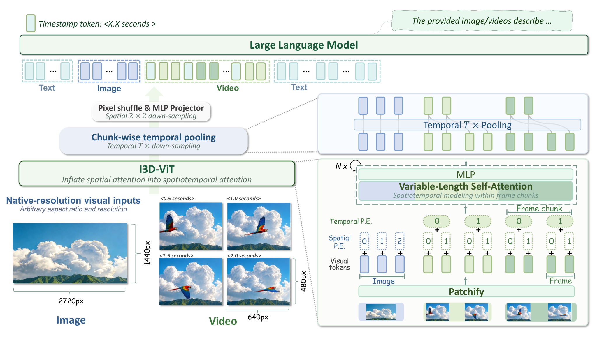</a>

模型结构、时间建模与训练方式

**模型结构：** I3D-ViT 将连续帧组成短片段，并将预训练二维空间注意力扩展为三维时空注意力。空间 2×2 合并与时间池化在 MLP 投影层和语言模型之前压缩 token。对于流式输入，生成的状态 token 控制帧分辨率配额，在回答之前为不确定或重要时刻分配更多视觉细节。

**时间建模：** 局部 3D 注意力在压缩之前捕获运动。按片段进行的时间池化减少冗余，流式状态转换则决定何时需要更多证据和更高分辨率。

**训练／推理方式：** 采用四个阶段：视觉 tokenizer 预训练、视频—语言对齐、通用视频指令微调，以及长视频／流式指令微调。先预热投影层，再联合适配；最后阶段利用长视频和回答时机监督训练投影层与 LLM。

**资料中提及的数据：** VideoChat3-Academic2M、VideoChat3-LV116K、流式指令数据。

**一手资料：** [来源 1](https://arxiv.org/abs/2607.14935) · [来源 2](https://arxiv.org/html/2607.14935v2) · [来源 3](https://github.com/MCG-NJU/VideoChat3)。

---

### InternVideo3

InternVideo3 在保留输入 token 的同时压缩多模态注意力状态，将高效长上下文注意力与闭环证据收集、记忆和核验结合，用于视频推理。

[论文](https://arxiv.org/abs/2606.12195) · [代码](https://github.com/OpenGVLab/InternVideo/tree/main/InternVideo3)

**作者：** Ziang Yan 等  
**首次公开日期：** 2026-06-10（arXiv v1 提交日期）  
**主要贡献：** 注意力架构、长上下文、智能体系统

<a href="assets/architectures/16-paper.png">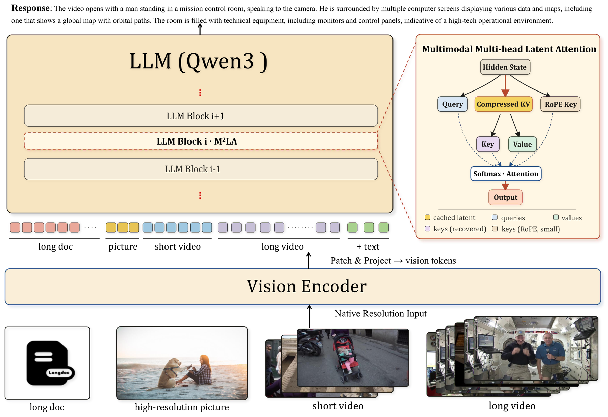</a>

模型结构、时间建模与训练方式

**模型结构：** 预训练多模态骨干模型的分组查询注意力被转换为 Multimodal Multi-head Latent Attention：缓存紧凑的潜在 KV 状态，并在注意力计算时重建各头的键和值。其视觉—语言 token 接口仍可用于视频输入。Multimodal Contextual Reasoning 将观测、推理轨迹、工具动作、反馈与记忆维护在持续演化的统一上下文中，迭代生成回答。

**时间建模：** 在压缩缓存状态时保留完整的多模态 token 流。视频智能体可通过检索和核验工具重新查看时间相关证据。

**训练／推理方式：** 注意力转换后继续预训练，随后进行从短到长的监督式视频微调、针对可核验任务的基于规则的强化学习，以及同策略教师蒸馏。论文还在训练后的骨干模型外单独配置检索与核验工具。

**一手资料：** [来源 1](https://arxiv.org/abs/2606.12195) · [来源 2](https://arxiv.org/html/2606.12195v1) · [来源 3](https://github.com/OpenGVLab/InternVideo/tree/main/InternVideo3)。

---

### LLaVA-OneVision-2

利用压缩视频信号，将视觉 token 分配给信息量较高的运动区域，并在统一的感知架构中处理编解码画布、采样帧与图像。

[论文](https://arxiv.org/abs/2605.25979) · [代码](https://github.com/EvolvingLMMs-Lab/LLaVA-OneVision-2)

**作者：** Xiang An 等  
**首次公开日期：** 2026-05-25（arXiv v1 提交日期）  
**主要贡献：** 模型架构、视频 token 化、训练方案、数据集

<a href="assets/architectures/25-paper.png">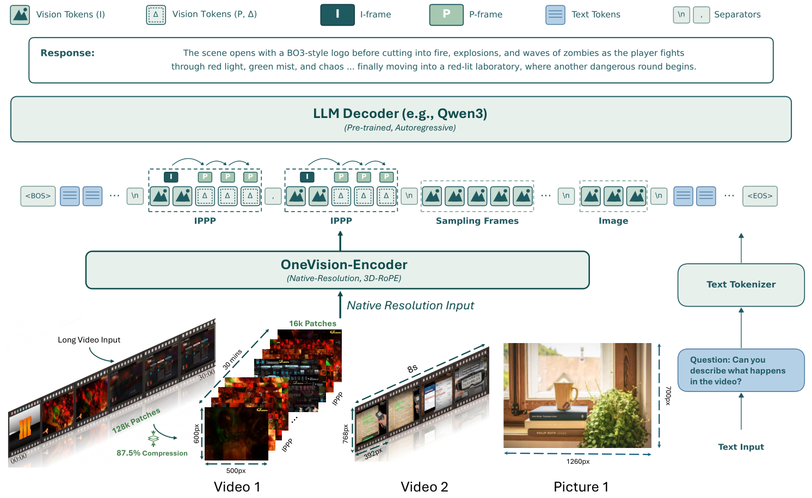</a>

模型结构、时间建模与训练方式

**模型结构：** 原生 OneVision-Encoder 处理图像、常规采样帧和紧凑的编解码画布。窗口注意力限制局部计算量，组可见性机制控制编解码证据之间的交互。轻量连接器合并视觉嵌入并将其投影至 Qwen3-8B。文本与视觉 token 共用自回归解码器；编解码处理没有引入独立的语言分支或重建解码器。

**时间建模：** 数据包的比特开销决定自适应时间分组，运动和残差信息用于选择空间 patch。共享的 3D RoPE 在编解码输入与帧输入之间保留原始坐标。

**训练／推理方式：** 四个渐进阶段从图像定位和短描述逐步过渡到长视频指令与空间监督。最后阶段混合编解码输入、采样视频和图像，同时支持视频定位与空间推理。

**一手资料：** [来源 1](https://arxiv.org/abs/2605.25979) · [来源 2](https://arxiv.org/html/2605.25979)。

---

### MiniCPM-V 4.6

通过小型语言骨干模型与早期视觉压缩，面向移动端图像和视频理解，并在视觉编码器内提供可选择的 token 预算。

[相关视觉编码论文](https://arxiv.org/abs/2605.08985) · [模型](https://huggingface.co/openbmb/MiniCPM-V-4.6) · [代码](https://github.com/OpenBMB/MiniCPM-V)

**作者：** OpenBMB / ModelBest  
**首次公开日期：** 2026-05-11（MiniCPM-V 官方仓库动态：2026-05-11 开源发布）  
**主要贡献：** 模型发布、视觉编码、token 压缩

<a href="assets/architectures/34-schematic.svg">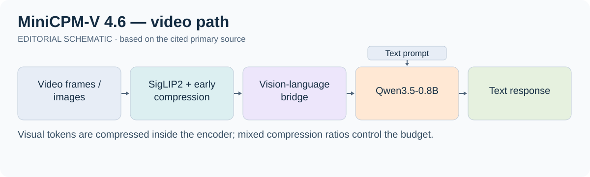</a>

模型结构、时间建模与训练方式

**模型结构：** 官方模型卡指定使用 SigLIP2-400M 和 Qwen3.5-0.8B。其视觉路径采用源自 LLaVA-UHD v4 的 ViT 内部早期压缩，并支持在语言解码前混合使用 4 倍或 16 倍 token 压缩。处理器控制图像切片与视频采样帧。该版本不同于 MiniCPM-V 4.5 明确采用统一 3D-Resampler 的视觉架构。

**时间建模：** 采样视频帧通过高效视觉路径处理。压缩控制空间 token 预算；模型卡中的示例给出了帧数限制和堆叠参数。

**训练／推理方式：** 该版本提供指令与思考模式的模型权重，以及微调集成。模型卡未列出完整预训练语料或分阶段视频训练方案；相关视觉编码论文描述的是一种技术，而非这套完整模型权重。

**版本说明：** MiniCPM-V 4.6 的主要来源是官方模型卡。LLaVA-UHD v4 是相关视觉压缩方法，并非以该模型名称发布的独立报告。

**一手资料：** [来源 1](https://huggingface.co/openbmb/MiniCPM-V-4.6) · [来源 2](https://github.com/OpenBMB/MiniCPM-V#news) · [来源 3](https://arxiv.org/abs/2605.08985)。

---

### Qwen3.5-Omni

通过混合注意力专家、显式时间戳及自适应文本语音对齐，扩展音视频推理与语音生成；经核验的公开入口提供托管服务。

[论文](https://arxiv.org/abs/2604.15804) · [托管 API](https://www.alibabacloud.com/help/en/model-studio/qwen-omni)

**作者：** Qwen 团队  
**首次公开日期：** 2026-04-17（arXiv v1 提交日期）  
**主要贡献：** 全模态架构、混合骨干模型、时间对齐

<a href="assets/architectures/62-paper.png">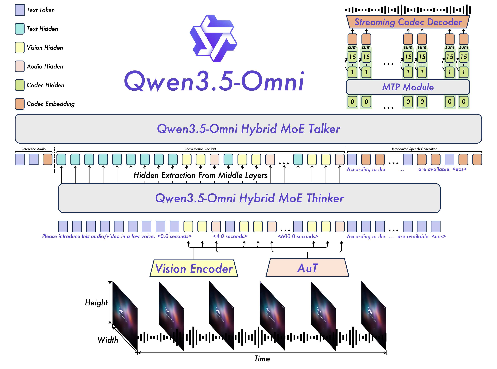</a>

模型结构、时间建模与训练方式

**模型结构：** SigLIP2 视觉特征与 AuT 音频特征输入采用混合注意力的 MoE Thinker。对应的混合 MoE Talker 以共享上下文和文本输出为条件。多码本语音预测与因果波形生成模块支持流式输出。ARIA 在交错排列前动态对齐文本与语音单元，减少对话生成过程中两种 tokenizer 速率不同导致的不稳定。

**时间建模：** 显式时间戳与交错的音视频输入组织长上下文。分块输入处理支持流式运行；ARIA 将输出语音与文本及持续对话对齐。

**训练／推理方式：** 报告描述了大规模异构多模态预训练与分阶段 Thinker/Talker 后训练。语音学习包括通用训练、更长上下文训练及对齐。公开文档支持托管推理；尚未核验公开模型权重或完整训练实现。

**公开情况：** 已核验技术报告与托管 API。尚未核验公开权重及可复现训练实现。后续 API 名称不足以据此建立独立架构条目。

**一手资料：** [来源 1](https://arxiv.org/abs/2604.15804) · [来源 2](https://arxiv.org/html/2604.15804)。

---

### Qwen3.5 → Qwen3.8-27B

采用原生视觉语言学习与混合循环—注意力骨干模型；后续发布的 Qwen3.8-27B 模型权重在这一基础上明确保留图像和视频支持。

[技术来源](https://qwen.ai/blog?id=qwen3.5) · [模型](https://huggingface.co/Qwen/Qwen3.5-397B-A17B) · [模型](https://huggingface.co/Qwen/Qwen3.8-27B) · [代码](https://github.com/QwenLM/Qwen3.8)

**作者：** Qwen 团队  
**首次公开日期：** 2026-02-16（Qwen3.5 官方发布公告；Qwen3.8-27B 发布日期：2026-08-14）  
**主要贡献：** 原生多模态训练、混合骨干模型、模型发布

<a href="assets/architectures/32-schematic.svg">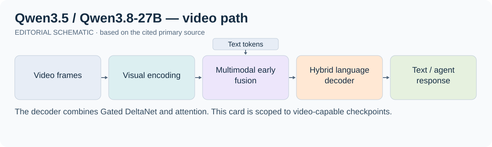</a>

模型结构、时间建模与训练方式

**模型结构：** 视觉编码器输出与文本共同进入原生多模态因果模型。Qwen3.5 结合 Gated DeltaNet 模块与门控注意力，其大规模版本使用稀疏专家。Qwen3.8-27B 则采用稠密前馈模块，以及三个 DeltaNet 模块对应一个注意力模块的重复布局。这些具体模型权重的结构由官方模型卡说明，并非来自独立的视频专用架构报告。

**时间建模：** 视频观测共享模型的多模态上下文。混合语言骨干模型提高序列处理效率；架构细节应归属于具体发布的模型权重。

**训练／推理方式：** Qwen3.5 描述了早期融合多模态预训练与大规模强化学习。Qwen3.8-27B 是后续经过后训练的版本，改进推理和智能体任务。其模型卡未提供完整、可复现的视频训练数据方案。

**一手资料：** [来源 1](https://huggingface.co/Qwen/Qwen3.5-397B-A17B) · [来源 2](https://huggingface.co/Qwen/Qwen3.8-27B) · [来源 3](https://github.com/QwenLM/Qwen3.8#news)。

---

### MiniCPM-o 4.5

通过 Omni-Flow 交互框架，将视觉、音频、文本与语音流对齐到共享时间线，实现持续感知、边感知边说话及主动响应。

[论文](https://arxiv.org/abs/2604.27393) · [代码](https://github.com/OpenBMB/MiniCPM-V)

**作者：** Junbo Cui 等  
**首次公开日期：** 2026-02-03（MiniCPM 官方仓库于 2026-02-03 发布；报告 arXiv v1 提交日期：2026-04-30）  
**主要贡献：** 全模态架构、全双工交互、训练方案

<a href="assets/architectures/59-paper.png">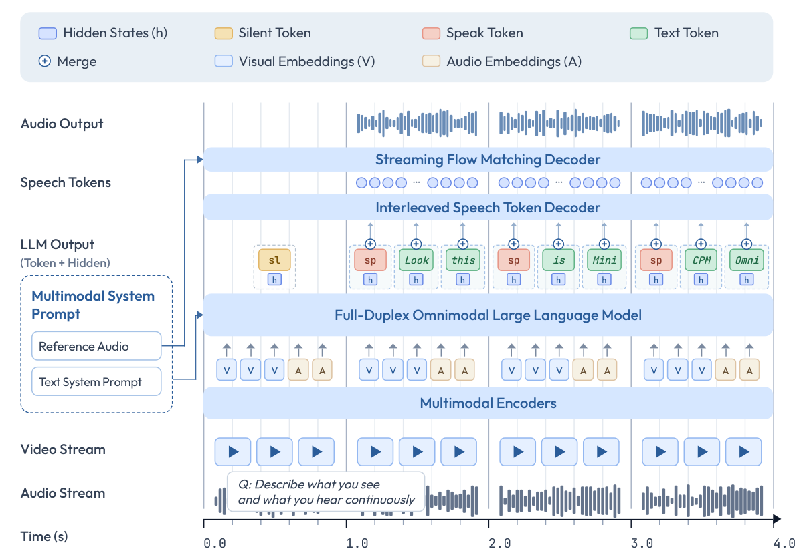</a>

模型结构、时间建模与训练方式

**模型结构：** SigLIP 家族的视觉特征经过重采样器，Whisper-medium 音频特征经过压缩时间维度的 MLP。Qwen3-8B 生成文本与隐藏状态，为轻量语音 token 解码器和波形生成模块提供输入。隐藏状态连接使模态模块可以端到端训练。Omni-Flow 将并行输入输出流转换为按局部时间组织的分组，由共享骨干模型处理。

**时间建模：** 小时间窗口交错执行感知、听说控制及输出生成。按时间对齐的文本与语音，使模型在持续说话过程中能够利用新到来的音视频证据调整响应。

**训练／推理方式：** 语音模块预训练从 MiniCPM 视觉语言模型权重和 Whisper 初始化。随后使用平衡的模态混合进行联合预训练，更新完整系统。监督微调（SFT）与强化学习进一步建立全双工、主动响应及高质量对话行为。

**一手资料：** [来源 1](https://arxiv.org/abs/2604.27393) · [来源 2](https://arxiv.org/html/2604.27393) · [来源 3](https://github.com/OpenBMB/MiniCPM-V#news)。

---

### Qwen3-VL

通过 DeepStack、交错式多模态旋转位置编码和文本化视频时间戳增强视觉语言融合，支持具有扩展多模态上下文的稠密模型与混合专家模型。

[论文](https://arxiv.org/abs/2511.21631) · [代码](https://github.com/QwenLM/Qwen3-VL)

**作者：** Shuai Bai 等  
**首次公开日期：** 2025-11-26（arXiv v1 提交日期）  
**主要贡献：** 模型架构、位置编码、训练方案

<a href="assets/architectures/31-paper.png">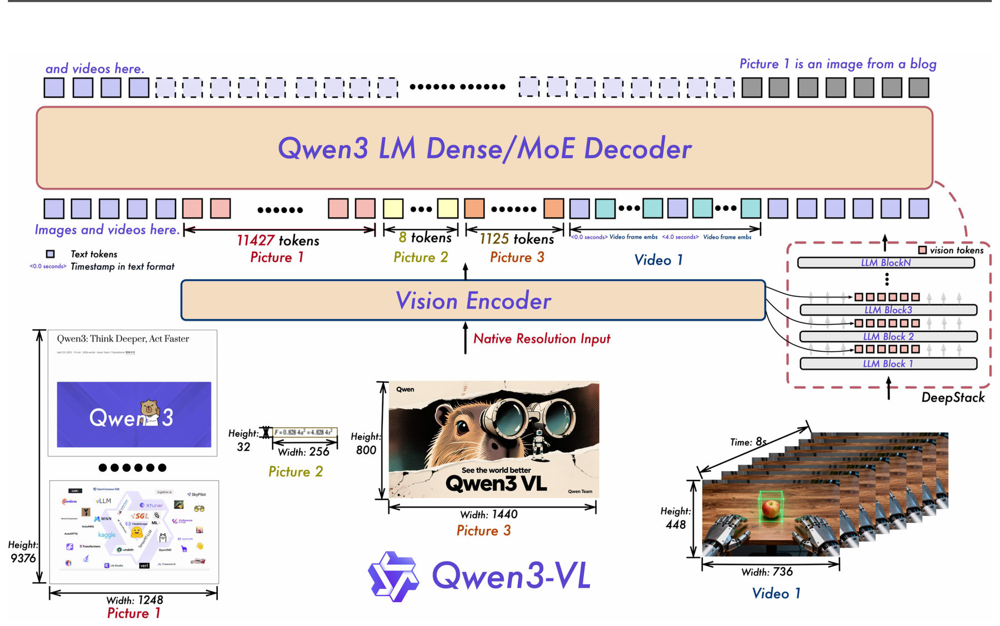</a>

模型结构、时间建模与训练方式

**模型结构：** 视觉编码器通过 MLP 合并模块连接至 Qwen3 稠密或 MoE 解码器。DeepStack 以残差连接将多个编码深度的视觉特征送入对应解码器层，无需增加上下文 token 即可改善融合。Interleaved-MRoPE 在时间和空间轴之间分配位置维度，同时为视频帧附加显式的时间戳文本。

**时间建模：** 文本化时间戳直接将帧锚定到视频时间。Interleaved-MRoPE 平衡时间与空间频率的分配，与长混合上下文中的帧序列相配合。

**训练／推理方式：** 合并模块预热后，进行全参数多模态预训练，并逐步扩展上下文。视频监督包括带时间戳的密集描述与时空定位。后训练结合监督推理、教师蒸馏及强化学习，增强任务执行能力。

**一手资料：** [来源 1](https://arxiv.org/abs/2511.21631) · [来源 2](https://arxiv.org/html/2511.21631)。

---

### StreamingVLM

StreamingVLM 将短片段训练与连续推理对齐，复用大小有界的视觉和文本 KV 窗口，在无限长的视频流中维持连贯解说。

[论文](https://arxiv.org/abs/2510.09608) · [代码](https://github.com/mit-han-lab/streaming-vlm)

**作者：** Ruyi Xu 等  
**首次公开日期：** 2025-10-10（arXiv v1 提交日期（UTC））  
**主要贡献：** 流式模型、KV 缓存策略、训练方案、评测基准

<a href="assets/architectures/51-paper.png">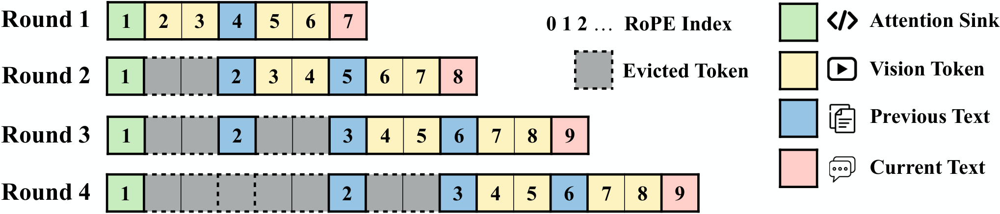</a>

模型结构、时间建模与训练方式

**模型结构：** Qwen2.5-VL 骨干模型处理交错的视频和文本，同时保留紧凑的 KV 缓存。注意力汇聚位置（attention sinks）稳定注意力，较短的近期视觉窗口捕捉正在发生的动作，较长的文本窗口保留先前解说。被移出的状态直接丢弃，无需重新计算。Contiguous RoPE 将索引平移到有界范围内，使流式位置保持接近训练条件。

**时间建模：** 近期视觉证据和较长文本历史提供不同的时间范围。重叠的训练片段维持上下文连续性，并近似流式推理使用的缓存结构。

**训练／推理方式：** 在相互重叠的流式解说片段上，使用完整注意力微调 Qwen2.5-VL-7B-Instruct。随后通过退火阶段使用高质量动作解说。论文报告的数据结合了 Inf-Streams 训练样本和 Live-WhisperX-526K；流式能力依赖这一步监督微调（SFT），仅修改缓存并不足够。

**资料中提及的数据：** Inf-Streams-Train、Live-WhisperX-526K。

**一手资料：** [来源 1](https://arxiv.org/abs/2510.09608)。

---

### Qwen3-Omni

采用 Thinker-Talker 混合专家系统进行音视频理解和语音生成，结合新音频编码器、多码本语音预测及高效流式波形生成。

[论文](https://arxiv.org/abs/2509.17765) · [代码](https://github.com/QwenLM/Qwen3-Omni)

**作者：** Jin Xu 等  
**首次公开日期：** 2025-09-22（arXiv v1 提交日期）  
**主要贡献：** 全模态架构、音频编码、流式生成

<a href="assets/architectures/61-paper.png">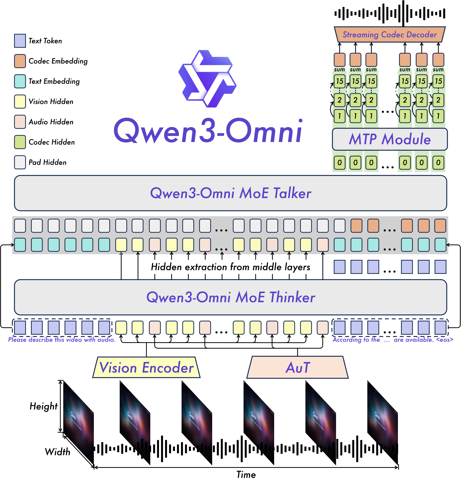</a>

模型结构、时间建模与训练方式

**模型结构：** AuT 音频编码器和以 SigLIP2 初始化的视觉编码器，为 Thinker MoE 语言模型生成表示。Talker 使用 Thinker 特征与对话上下文，预测具有多个码本的语音编解码 token。小型多 token 预测模块生成残差码本，因果卷积 Code2Wav 网络逐步生成音频，替代早期较重的分块波形生成路径。

**时间建模：** 按时间对齐的音视频输入支持联合感知。多码本预测与因果波形生成逐帧输出流式语音，同时保留共享的多模态对话上下文。

**训练／推理方式：** 编码器对齐之后，进行联合多模态预训练与更长上下文训练。AuT 使用语音识别和音频理解数据学习。指令微调、蒸馏与强化学习改进输出，并提供面向推理与音频描述的专用变体。

**一手资料：** [来源 1](https://arxiv.org/abs/2509.17765) · [来源 2](https://arxiv.org/html/2509.17765)。

---

### MiniCPM-V 4.5

使用统一的 3D-Resampler 压缩图像和相邻视频帧，将高效视觉 token 与统一文档学习、短思考和长思考后训练相结合。

[论文](https://arxiv.org/abs/2509.18154) · [代码](https://github.com/OpenBMB/MiniCPM-V)

**作者：** Tianyu Yu 等  
**首次公开日期：** 2025-09-16（arXiv v1 提交日期）  
**主要贡献：** 模型架构、token 压缩、训练方案

模型结构、时间建模与训练方式

**模型结构：** SigLIP2-400M 编码图像切片与采样视频帧，Qwen3-8B 提供语言骨干模型。统一的 3D-Resampler 使用可学习查询来压缩两种输入：图像进行空间重采样，按时间打包的帧组则结合空间与时间位置联合重采样。拼接后的分组表示构成送入语言解码器的紧凑视觉输入。

**时间建模：** 相邻帧共享一个重采样包，并使用带时间位置的查询。训练时改变包大小和采样率，推理时也可以调整。

**训练／推理方式：** 渐进式预训练先对齐重采样器，再适配视觉组件，最后更新完整模型。动态视觉扰动统一文档与 OCR 学习。指令微调引入 3D-Resampler，随后通过混合强化学习训练两种推理模式。

**一手资料：** [来源 1](https://arxiv.org/abs/2509.18154) · [来源 2](https://arxiv.org/html/2509.18154) · [来源 3](https://huggingface.co/openbmb/MiniCPM-V-4_5)。

---

### InternVL3.5

结合原生多模态学习、Cascade RL 及可选的视觉分辨率路由，提升图像、视频和更广泛任务中的推理能力与部署效率。

[论文](https://arxiv.org/abs/2508.18265) · [代码](https://github.com/OpenGVLab/InternVL)

**作者：** Weiyun Wang 等  
**首次公开日期：** 2025-08-25（arXiv v1 提交日期）  
**主要贡献：** 训练方案、token 压缩、部署系统

<a href="assets/architectures/28-paper.png">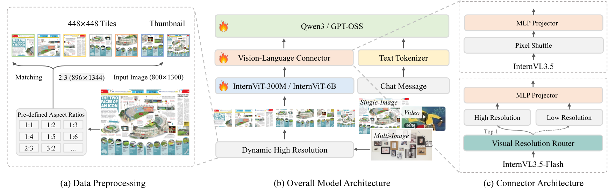</a>

模型结构、时间建模与训练方式

**模型结构：** InternVL3.5 保留 InternViT、空间 token 压缩、MLP 投影层及 Qwen3 或 GPT-OSS 语言骨干模型。其 Flash 变体加入视觉分辨率路由器，根据语义内容为每个图像分块选择压缩率。解耦视觉语言部署将视觉编码与语言推理安排在不同设备上，并使两者重叠执行。

**时间建模：** 视频仍以视觉帧 token 序列表示。分辨率路由调整其空间 token 预算；这些效率机制没有引入独立的时间编码器。

**训练／推理方式：** 原生多模态预训练和监督微调建立基础能力。Cascade RL 结合离线与在线优化来增强推理。Flash 额外使用视觉一致性与路由器训练，在减少视觉 token 预算时保持性能。

**一手资料：** [来源 1](https://arxiv.org/abs/2508.18265) · [来源 2](https://arxiv.org/html/2508.18265)。

---

### Flash-VStream（Flash Memory）

后续版本的 Flash-VStream 用 Flash Memory 替代 STAR Memory，在压缩的长期上下文与选取的高分辨率细节之间取得平衡，支持异步流式视频交互。

[论文](https://arxiv.org/abs/2506.23825) · [代码](https://github.com/IVGSZ/Flash-VStream/tree/main/Flash-VStream-Qwen)

**作者：** Haoji Zhang 等  
**首次公开日期：** 2025-06-30（arXiv v1 提交日期（UTC））  
**主要贡献：** 流式模型、记忆架构、异步推理

<a href="assets/architectures/48-paper.png">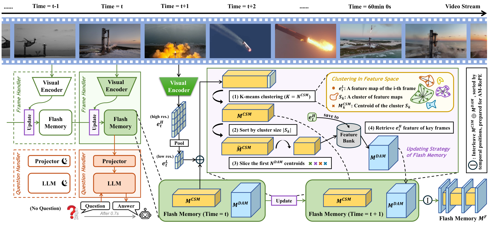</a>

模型结构、时间建模与训练方式

**模型结构：** 基于 Qwen2-VL 的帧处理器持续产生视觉特征并维护特征库。Context Synopsis Memory 对跨帧的低分辨率特征进行聚类，以概括历史。Detail Augmentation Memory 从信息丰富的帧中检索高分辨率特征。两类记忆按时间顺序交错排列，由独立的问题处理器读取，再经合并投影层送入 LLM。

**时间建模：** 上下文聚类估计信息密度随时间的分布；细节选择将高分辨率证据集中到信息丰富的时刻，同时保持记忆的时间顺序，以支持时间推理。

**训练／推理方式：** 视觉编码器、合并投影层和 LLM 均由 Qwen2-VL-7B 初始化。冻结视觉编码器，在包含 9K 样本的 LLaVA-Video 子集上，对投影层和 LLM 的线性层应用 LoRA。该条目对应 2025 年的 Flash Memory 论文及 Qwen 实现。

**资料中提及的数据：** LLaVA-Video 子集。

**一手资料：** [来源 1](https://arxiv.org/abs/2506.23825)。

---

### TimeChat-Online

TimeChat-Online 在语言解码之前去除静态内容的时间冗余，保留 token 的原始位置，并利用视频变化在流式交互中触发主动响应。

[论文](https://arxiv.org/abs/2504.17343) · [代码](https://github.com/yaolinli/TimeChat-Online)

**作者：** Linli Yao 等  
**首次公开日期：** 2025-04-24（arXiv v1 提交日期（UTC））  
**主要贡献：** 流式模型、token 剪枝、指令数据、主动交互

<a href="assets/architectures/50-paper.png">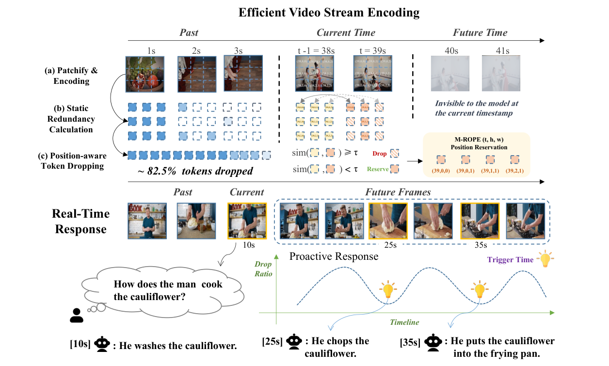</a>

模型结构、时间建模与训练方式

**模型结构：** Qwen2.5-VL 编码密集采样的视频帧。Differential Token Drop 比较相邻帧中空间位置对应的 token，移除足够相似的特征。保留下来的 token 在进入投影层和语言模型之前仍使用原始的多模态 RoPE 索引。FIFO 存储库保留近期压缩后的 token，较低的丢弃比例用于识别场景变化，并可触发主动响应。

**时间建模：** 相邻帧差异保留发生变化的内容；保留时间、高度和宽度索引可避免剪枝造成位置失真。基于场景变化的信号决定主动响应时机。

**训练／推理方式：** 冻结视觉编码器，在混合的离线和在线指令数据上对整个投影层和 LLM 进行微调。TimeChat-Online-139K 包含带时间戳的流式问题及无法回答的案例。DTD 本身不含可训练参数，但完整的在线助手需要接受监督训练。

**资料中提及的数据：** TimeChat-Online-139K、LLaVA-Video-178K 子集、Tarsier2 子集。

**一手资料：** [来源 1](https://arxiv.org/abs/2504.17343)。

---

### Eagle 2.5

通过渐进式长上下文后训练与信息保留采样扩展通用视觉语言结构，在合理分配上下文预算的同时支持长视频与高分辨率图像。

[论文](https://arxiv.org/abs/2504.15271) · [代码](https://github.com/NVlabs/Eagle/tree/main/Eagle2_5)

**作者：** Guo Chen 等  
**首次公开日期：** 2025-04-21（arXiv v1 提交日期）  
**主要贡献：** 训练方案、数据整理、上下文扩展、采样

<a href="assets/architectures/36-paper.png">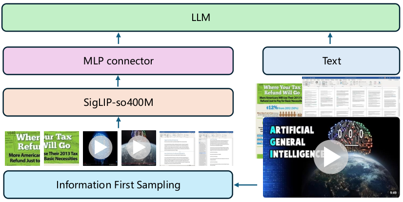</a>

模型结构、时间建模与训练方式

**模型结构：** SigLIP 视觉特征经过 MLP 投影层送入 Qwen2.5。模型使用图像分块处理可变分辨率，并保留直接的视觉语言结构。Image Area Preservation 优先选择能够保留原始内容的分块方式。Automatic Degrade Sampling 在视觉与文本输入之间分配可用上下文，保留完整监督信息，并按需调整视觉细节。

**时间建模：** 渐进式上下文训练容纳更多有序帧。Automatic Degrade Sampling 在上下文预算内调整帧数与视觉 token 分配，同时保留文本监督。

**训练／推理方式：** 混合后训练逐步增加上下文长度，结合多样的公开视觉指令数据与 Eagle-Video-110K。该数据的标注融合局部片段描述与全局故事信息，通过数据和训练建立长视频理解能力，未使用专用时间编码器。

**一手资料：** [来源 1](https://arxiv.org/abs/2504.15271) · [来源 2](https://arxiv.org/html/2504.15271)。

---

### InternVL3

在多模态预训练中共同发展语言与视觉能力，为 InternVL 结构加入可变视觉位置编码，并改进后训练及推理方案。

[论文](https://arxiv.org/abs/2504.10479) · [代码](https://github.com/OpenGVLab/InternVL)

**作者：** Jinguo Zhu 等  
**首次公开日期：** 2025-04-14（arXiv v1 提交日期）  
**主要贡献：** 训练方案、位置编码、上下文扩展

<a href="assets/architectures/27-schematic.svg">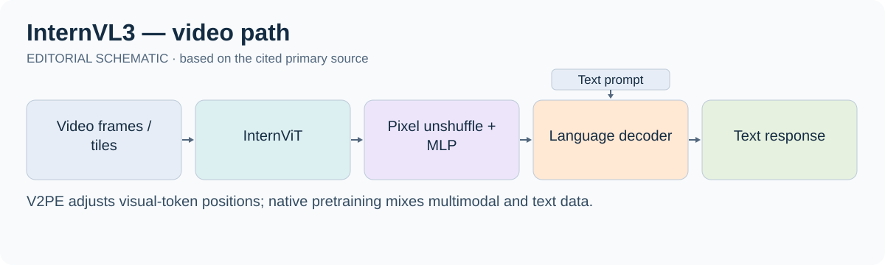</a>

模型结构、时间建模与训练方式

**模型结构：** InternViT 编码器、pixel unshuffle 和随机初始化的两层 MLP 连接至预训练的 Qwen2.5 或 InternLM3 基础解码器。图像分块和视频帧转化为视觉 token，进入混合文本上下文。可变视觉位置编码为视觉 token 分配灵活的位置增量，在保留编码器—投影层—解码器结构的同时，提高上下文扩展能力。

**时间建模：** V2PE 通过可变增量减少视觉输入占用的位置，支持更长的多模态上下文。有序帧输入仍由自回归语言骨干模型共同解释。

**训练／推理方式：** 原生多模态预训练从预训练组件初始化，联合使用视觉数据和纯文本。随后进行监督微调（SFT）与混合偏好优化；过程奖励模型和测试时扩展进一步增强推理能力。

**一手资料：** [来源 1](https://arxiv.org/abs/2504.10479) · [来源 2](https://arxiv.org/html/2504.10479)。

---

### Slow-Fast Video MLLM

通过交叉注意力保留可访问的详细视觉证据，并将压缩预览 token 输入自注意力，使混合语言解码器能够根据指令读取视频。

[论文](https://arxiv.org/abs/2504.01328) · [代码](https://github.com/SHI-Labs/Slow-Fast-Video-Multimodal-LLM)

**作者：** Min Shi 等  
**首次公开日期：** 2025-04-02（arXiv v1 提交日期）  
**主要贡献：** 模型架构、混合注意力、问题条件化

<a href="assets/architectures/64-paper.png">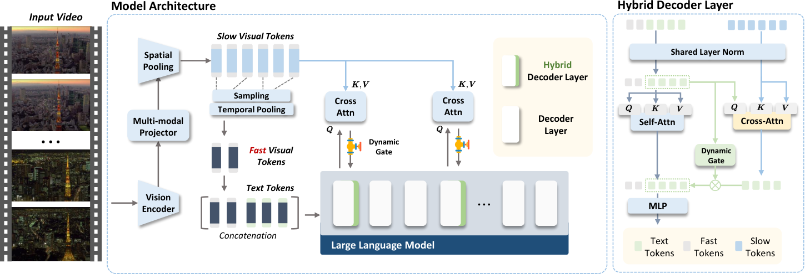</a>

模型结构、时间建模与训练方式

**模型结构：** ConvNeXt-XXL 与投影层生成慢路径视觉特征。步幅采样和时间池化构造压缩后的快路径 token，与文本拼接后进入 Qwen2-7B 自注意力。在选定解码器层加入文本到未压缩慢路径特征的交叉注意力。动态门控与预热系数控制这条残差路径，保留细节而无需将每个视觉 token 都装入自注意力。

**时间建模：** 快路径 token 提供广泛的时间预览，以文本为条件的交叉注意力则读取详细慢路径证据。时间池化控制预览长度，同时保留可访问的慢路径表示。

**训练／推理方式：** 交叉注意力投影在适用位置继承语言自注意力权重，预热门控稳定整合过程。视觉语言对齐之后进行混合图像、视频与文本指令微调，训练混合解码器选择有用的细粒度证据。

**一手资料：** [来源 1](https://arxiv.org/abs/2504.01328) · [来源 2](https://arxiv.org/html/2504.01328)。

---

### Mobile-VideoGPT

结合高效空间与时间编码器、基于注意力的帧选择及小型语言模型，面向低成本视频问答和边缘设备部署。

[论文](https://arxiv.org/abs/2503.21782) · [代码](https://github.com/Amshaker/Mobile-VideoGPT)

**作者：** Abdelrahman Shaker 等  
**首次公开日期：** 2025-03-27（arXiv v1 提交日期）  
**主要贡献：** 模型架构、帧选择、高效投影层

<a href="assets/architectures/63-paper.png">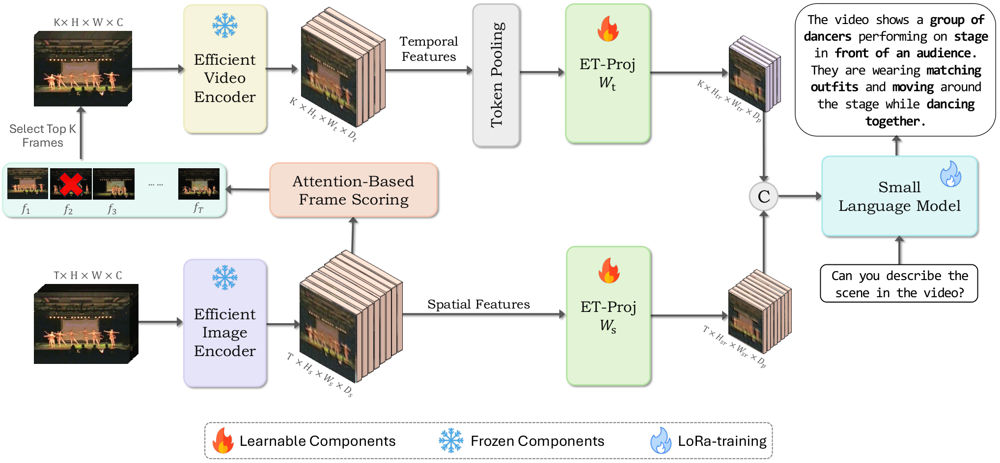</a>

模型结构、时间建模与训练方式

**模型结构：** CLIP-B/16 从所有采样帧提取空间特征。基于注意力的评分选择显著帧，交由 VideoMamba-M 进行时间编码。Efficient Token Projectors 细化特征，通过池化减少 token，并在融合空间与时间表示前加入位置上下文。Qwen2.5 小型语言模型接收紧凑的视觉语言序列，生成视频问题的回答。

**时间建模：** 帧评分将时间编码器计算限制在选定观测上。VideoMamba 捕获运动上下文，投影后的空间与时间 token 为解码器保留互补证据。

**训练／推理方式：** 图像投影层与视频投影层预热时，保持预训练编码器及语言模型冻结。随后，指令微调使用混合图像与视频对话数据训练两个投影层，并对语言模型应用 LoRA。

**一手资料：** [来源 1](https://arxiv.org/abs/2503.21782) · [来源 2](https://arxiv.org/html/2503.21782)。

---

### Qwen2.5-Omni

使用 Thinker 与 Talker 分离多模态推理和语音生成，将音频与视频按时间对齐，同时生成流式文本与语音响应。

[论文](https://arxiv.org/abs/2503.20215) · [代码](https://github.com/QwenLM/Qwen2.5-Omni)

**作者：** Jin Xu 等  
**首次公开日期：** 2025-03-26（arXiv v1 提交日期）  
**主要贡献：** 全模态架构、时间对齐、流式生成

<a href="assets/architectures/60-paper.png">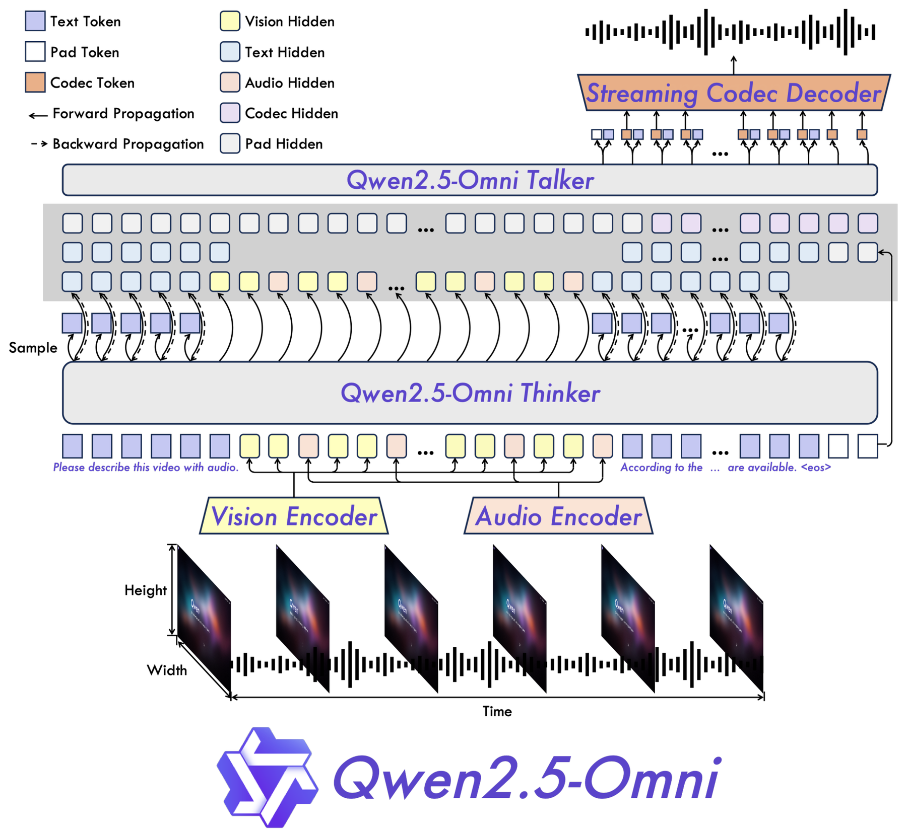</a>

模型结构、时间建模与训练方式

**模型结构：** Qwen2.5-VL 视觉编码器和源自 Qwen2-Audio 的音频编码器连接至 Thinker 语言解码器。时间对齐的多模态 RoPE 整合音频时间戳与帧空间位置。Thinker 将文本与隐藏表示输出至 Talker；Talker 是共享对话上下文的语音生成解码器。语音编解码 token 由流式波形解码器转换为声音，组成可端到端训练的多模态系统。

**时间建模：** 分块音视频处理与 TMRoPE 将音频片段和视频帧放在共同时间尺度上。无需等待完整响应生成完毕，即可开始流式输出。

**训练／推理方式：** 编码器与适配器对齐阶段首先冻结语言骨干模型。联合多模态预训练随后更新全部组件，再进行更长上下文训练。监督指令微调与偏好优化改善理解、对话行为及语音生成。

**一手资料：** [来源 1](https://arxiv.org/abs/2503.20215) · [来源 2](https://arxiv.org/html/2503.20215)。

---

### Qwen2.5-VL

在 Qwen 视觉语言结构中加入高效窗口视觉注意力、动态视频采样和绝对时间位置编码，支持长视频理解及精确时间定位。

[论文](https://arxiv.org/abs/2502.13923) · [代码](https://github.com/QwenLM/Qwen2.5-VL)

**作者：** Shuai Bai 等  
**首次公开日期：** 2025-02-19（arXiv v1 提交日期）  
**主要贡献：** 模型架构、位置编码、训练方案

<a href="assets/architectures/30-paper.png">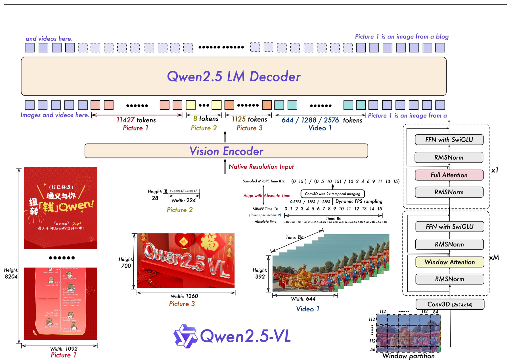</a>

模型结构、时间建模与训练方式

**模型结构：** 动态分辨率 ViT 处理原生尺寸图像与视频时空管块，主要使用窗口注意力，并在选定层使用全局注意力。空间合并将视觉特征映射至 Qwen2.5 解码器。RMSNorm 和 SwiGLU 使视觉架构与语言骨干模型保持一致。解码器接收混合的文本与视觉 token，MRoPE 的时间 ID 与实际时间戳关联。

**时间建模：** 动态 FPS 训练使模型接触不同采样率。绝对时间 ID 保留真实经过时间的含义，帮助模型区分事件速度并定位具体时刻。

**训练／推理方式：** 渐进式多模态预训练使用图像、视频、文档、定位与文本数据，逐步提升能力并增加序列长度。随后进行监督微调（SFT）与直接偏好优化，改善所支持任务中的指令遵循及行为对齐。

**一手资料：** [来源 1](https://arxiv.org/abs/2502.13923) · [来源 2](https://arxiv.org/html/2502.13923)。

---

### VideoLLaMA 3

VideoLLaMA 3 结合任意分辨率视觉 token 化与差分帧剪枝，通过分阶段训练将较强的图像理解能力迁移到高效视频感知。

[论文](https://arxiv.org/abs/2501.13106) · [代码](https://github.com/DAMO-NLP-SG/VideoLLaMA3)

**作者：** Boqiang Zhang 等  
**首次公开日期：** 2025-01-22（arXiv v1 提交日期）  
**主要贡献：** 模型架构、token 压缩、训练方案

<a href="assets/architectures/13-paper.png">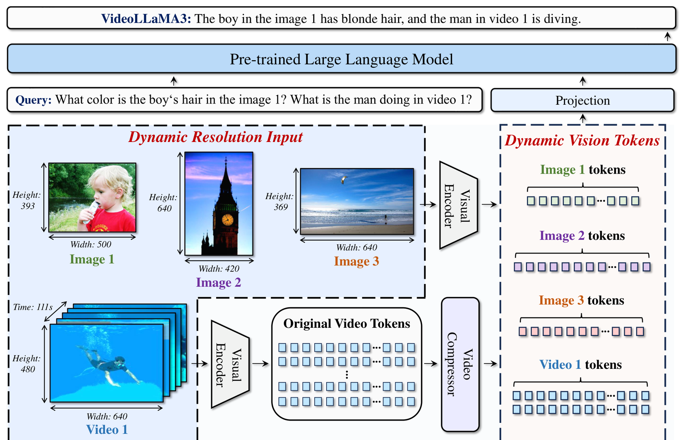</a>

模型结构、时间建模与训练方式

**模型结构：** 以 SigLIP 初始化的视觉 Transformer 通过二维旋转位置嵌入适配可变分辨率。Differential Frame Pruning 在像素空间比较相邻帧，移除冗余图像块。保留下来的视觉特征经多模态投影层输入 Qwen2.5 语言骨干模型。显式文本时间戳区分不同视频帧，模型支持图像、离线视频及交错输入的流式视频。

**时间建模：** 相邻帧的图像块差异驱动冗余移除。保留的帧 token 与时间戳按顺序输入 LLM，将上下文预算集中用于发生变化的视频证据。

**训练／推理方式：** 四个阶段依次为视觉编码器适配、视觉—语言对齐、多任务指令微调和视频专项微调。第一阶段冻结 LLM；后续阶段训练全部参数，引入视频压缩以及逐步侧重视频的监督。

**一手资料：** [来源 1](https://arxiv.org/abs/2501.13106) · [来源 2](https://arxiv.org/html/2501.13106v4) · [来源 3](https://github.com/DAMO-NLP-SG/VideoLLaMA3)。

---

### InternVideo2.5

InternVideo2.5 在 InternVL2.5 基础上增加分层视觉压缩和任务偏好优化，以更长的视频上下文与更丰富的监督支持细粒度感知和推理。

[论文](https://arxiv.org/abs/2501.12386) · [代码](https://github.com/OpenGVLab/InternVideo/tree/main/InternVideo2.5)

**作者：** Yi Wang 等  
**首次公开日期：** 2025-01-21（arXiv v1 提交日期）  
**主要贡献：** 模型架构、token 压缩、偏好优化

<a href="assets/architectures/15-paper.png">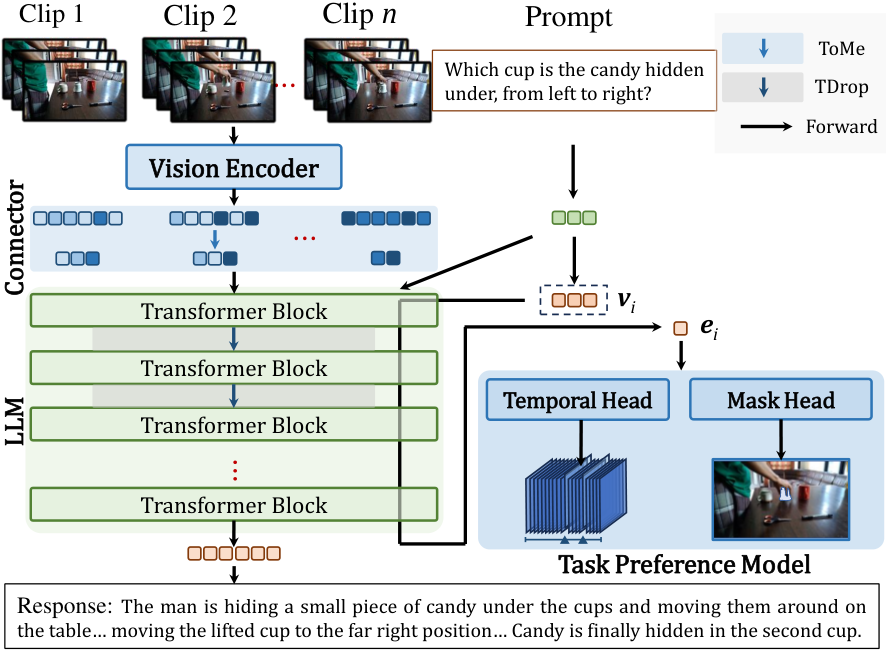</a>

模型结构、时间建模与训练方式

**模型结构：** 系统基于 InternVL2.5 构建。Hierarchical Token Compression 在语言解码器之前合并视频片段内部及片段之间语义冗余的时空 token。任务专用的视觉感知头通过可学习任务嵌入与骨干模型交互。丰富的标注与 Task Preference Optimization 共同改善细致定位、时间感知，以及对压缩后长程证据的利用。

**时间建模：** 分层压缩利用时间片段内部与片段之间的冗余，同时保留关键运动和事件，使语言上下文能够容纳更长的视频。

**训练／推理方式：** 依次进行视觉—文本对齐、长视频上下文扩展和任务专用视觉训练。丰富的视觉标注与 Task Preference Optimization 提供额外的感知任务偏好监督，补充通用视频描述和问答监督。

**资料中提及的数据：** LLaVA-Video-178K、ShareGPT4o、VideoChat2、InternVideo2、MovieChat。

**一手资料：** [来源 1](https://arxiv.org/abs/2501.12386) · [来源 2](https://arxiv.org/html/2501.12386v3) · [来源 3](https://github.com/OpenGVLab/InternVideo/tree/main/InternVideo2.5)。

---

### Tarsier2

2025 年的 Tarsier2 报告通过扩大多任务预训练、帧—事件监督和自动偏好优化，改进基于 Qwen2-VL 的模型，实现全面视频理解。

[论文](https://arxiv.org/abs/2501.07888) · [代码](https://github.com/bytedance/tarsier)

**作者：** Liping Yuan 等  
**首次公开日期：** 2025-01-14（arXiv v1 提交日期）  
**主要贡献：** 训练方案、时间监督、偏好优化

<a href="assets/architectures/20-schematic.svg">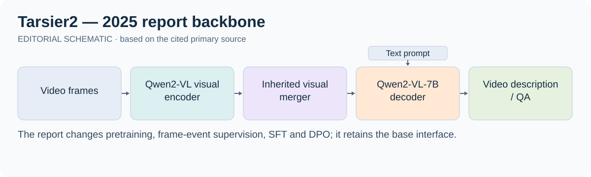</a>

模型结构、时间建模与训练方式

**模型结构：** 报告中的 7B 模型从 Qwen2-VL 初始化，保留该骨干模型的视觉 token 化方式和语言接口。视频 token 与指令联合处理，用于自回归文本生成。主要改动涉及监督和优化，而非新提出的连接器。应将这一报告版本与此前项目中同样名为 Tarsier2 的检查点区分。

**时间建模：** 细粒度标注将每个事件描述与支撑它的帧区间对应，训练时间定位能力并减少事件遗漏。继承的视频 token 序列将视觉证据传递给 LLM。

**训练／推理方式：** 先在 40M 个公开及新收集样本上预训练，再使用具有时间定位标注的描述与自然描述进行两阶段监督微调（SFT）。自动构建的偏好对配合细粒度事件评估，用于 DPO，改善视频描述的事实准确性和完整性。

**资料中提及的数据：** 40M 混合预训练数据、150K 个 SFT 视频片段、Tarsier2 偏好数据。

**版本说明：** 本条目介绍从 Qwen2-VL 初始化的 2025 年报告版本，而非此前配置不同的项目检查点。

**一手资料：** [来源 1](https://arxiv.org/abs/2501.07888) · [来源 2](https://arxiv.org/html/2501.07888v3) · [来源 3](https://github.com/bytedance/tarsier)。

[原论文偏好训练流程图](assets/architectures/20-paper.png) · [原始来源与署名](https://arxiv.org/html/2501.07888v3#S3.F5)。

---

### VideoChat-Flash

在语言解码前及解码器内部对视频 token 进行分层压缩，结合局部时空合并与推理时视觉 token 丢弃，高效理解长帧序列。

[论文](https://arxiv.org/abs/2501.00574) · [代码](https://github.com/OpenGVLab/VideoChat-Flash)

**作者：** Xinhao Li 等  
**首次公开日期：** 2024-12-31（arXiv v1 提交日期）  
**主要贡献：** 模型架构、token 压缩、推理效率

<a href="assets/architectures/44-paper.png">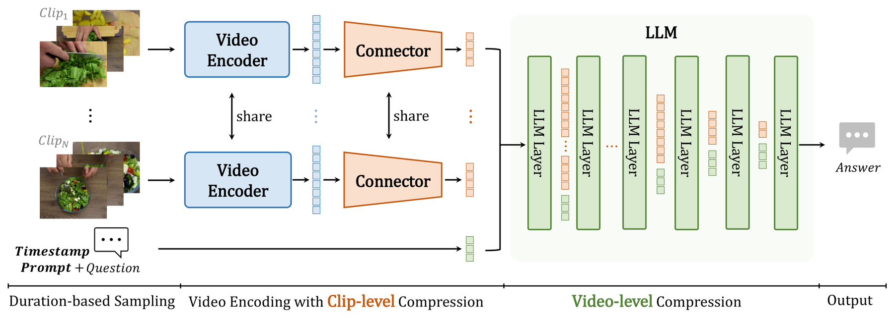</a>

模型结构、时间建模与训练方式

**模型结构：** UMT-L 使用时空注意力编码包含多帧的短片段。相似 token 合并与 MLP 连接器先压缩每个片段，再将 token 送入 Qwen2-7B。第二个视频级阶段在推理期间，沿语言模型各层逐步丢弃视觉 token。这种分层结构利用局部帧冗余，以及解码器对广泛视频证据和细节证据需求的变化。

**时间建模：** 片段级注意力与合并概括相邻帧。浅层语言层保留广泛覆盖，深层则通过渐进式 token 丢弃越来越集中于相关时刻。

**训练／推理方式：** 视觉预训练与从短到长的指令学习结合图像、短片段和较长视频监督。训练使模型学会使用压缩片段接口；视频级丢弃阶段应用于推理，而非作为常规训练时 token 掩码使用。

**版本说明：** 虽然 arXiv 编号以 2501 开头，v1 提交日期实际为 2024-12-31。

**一手资料：** [来源 1](https://arxiv.org/abs/2501.00574) · [来源 2](https://arxiv.org/html/2501.00574)。

---

### Apollo

Apollo 将图像、视频编码器与 Perceiver token 重采样结合，通过系统研究采样、融合、训练和数据，形成实用的视频—语言架构。

[论文](https://arxiv.org/abs/2412.10360) · [官方项目](https://apollo-lmms.github.io/) · [模型](https://huggingface.co/Apollo-LMMs)

**作者：** Orr Zohar 等  
**首次公开日期：** 2024-12-13（arXiv v1 提交日期）  
**主要贡献：** 模型架构、架构设计研究、训练方案、评测基准

<a href="assets/architectures/17-paper.png">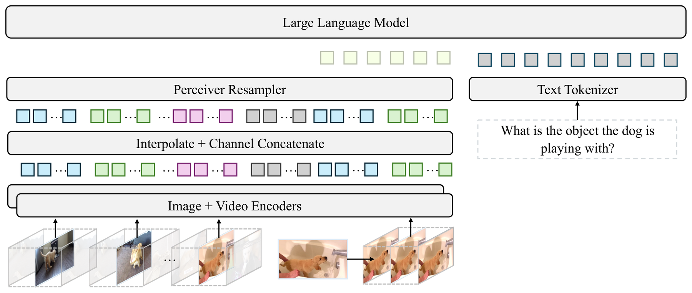</a>

模型结构、时间建模与训练方式

**模型结构：** SigLIP-SO400M 提供空间细节，InternVideo2 提供视频特征。两个编码器的输出先插值到兼容布局，再沿通道维度拼接，并由 Perceiver Resampler 压缩为每帧 32 个 token。片段时间戳与投影后的视觉 token 一同输入 Qwen2.5 语言骨干模型，发布的模型规模为 1.5B、3B 和 7B。

**时间建模：** 视频编码器捕获局部动态；按帧率采样与带时间戳的片段序列向 LLM 展示视频进程。论文分别研究每秒帧数与每秒 token 数的影响。

**训练／推理方式：** 采用论文中的三阶段渐进训练方案，先学习连接器，再适配语言和视觉组件。在 LLM 参与训练时，混合使用文本、图像、多图像和视频监督。

**公开情况：** 使用官方项目页面与 Apollo-LMMs 模型页面。第三方代码镜像不视为作者官方实现。

**一手资料：** [来源 1](https://arxiv.org/abs/2412.10360) · [来源 2](https://arxiv.org/html/2412.10360v1) · [来源 3](https://apollo-lmms.github.io/) · [来源 4](https://huggingface.co/Apollo-LMMs)。

---

### StreamChat（Liu 等）

Liu 等人的 StreamChat 在每一步文本解码时更新视觉上下文，使生成的回答能够跟随问题提出之后发生的视频变化。

[论文](https://arxiv.org/abs/2412.08646) · [官方项目](https://jihaonew.github.io/projects/streamchat.html)

**作者：** Jihao Liu 等  
**首次公开日期：** 2024-12-11（arXiv v1 提交日期（UTC））  
**主要贡献：** 流式模型、交叉注意力、位置编码、指令数据

<a href="assets/architectures/49-paper.png">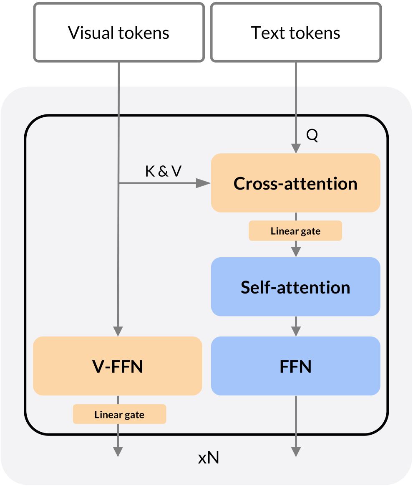</a>

模型结构、时间建模与训练方式

**模型结构：** SigLIP 帧 token 经 MLP 映射到 Qwen2.5。新增的交叉注意力模块以文本为查询，以视觉表示为键和值；视觉前馈专家则在模块之间更新视觉表示。线性门控稳定新增分支。独立线程持续更新 FIFO 视觉 token 队列，解码器在生成每个新 token 时读取该队列。

**时间建模：** Parallel 3D-RoPE 为同时出现的视觉和文本 token 分配相同的时间坐标。因果时间戳掩码在训练期间防止文本访问未来帧。

**训练／推理方式：** 先逐步对齐适配器，再在多模态预训练期间解冻视觉组件。全参数指令微调混合已有的图像／视频指令，以及由 Ego4D 和 Vript 构建的带密集时间戳的流式指令。这一交叉注意力模型与 Xiong 等人的记忆系统不同。

**公开情况：** 截至核查日期，官方项目页面仍将代码标为即将发布；Xiong 等人的同名仓库对应另一套系统。

**一手资料：** [来源 1](https://arxiv.org/abs/2412.08646)。

---

### InternVL2.5

通过改进视觉编码器、筛选多模态数据、偏好优化及推理方案，扩展已有视觉语言架构的能力，支持多帧视频理解。

[论文](https://arxiv.org/abs/2412.05271) · [代码](https://github.com/OpenGVLab/InternVL)

**作者：** Zhe Chen 等  
**首次公开日期：** 2024-12-06（arXiv v1 提交日期）  
**主要贡献：** 训练方案、数据整理、规模扩展

<a href="assets/architectures/26-paper.png">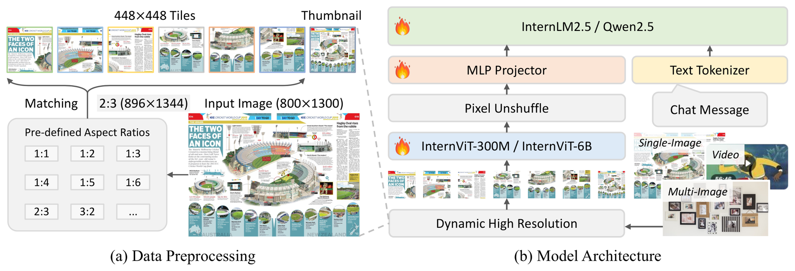</a>

模型结构、时间建模与训练方式

**模型结构：** InternViT-300M 或 InternViT-6B 编码每个图像分块或采样帧。Pixel unshuffle 先减少空间 token 数量，再由两层 MLP 将特征映射至 InternLM2.5 或 Qwen2.5 语言模型。视频帧作为有序视觉输入进入解码器。核心结构沿用早期 InternVL 版本，改进主要集中在规模扩展与优化。

**时间建模：** 视频训练使用帧序列，每帧对应一个分块。帧的顺序进入语言上下文，没有新引入的专用时间编码器。

**训练／推理方式：** MLP 预热之后进行可选的视觉适配及完整的指令微调。数据过滤、渐进式模型扩展、损失重加权及混合偏好优化改善学习效果；思维链推理与测试时扩展进一步提升性能。

**一手资料：** [来源 1](https://arxiv.org/abs/2412.05271) · [来源 2](https://arxiv.org/html/2412.05271)。

---

### LongVU

根据视频和问题调整时间与空间压缩，利用互补视觉特征，在有限语言上下文窗口内保留有用证据。

[论文](https://arxiv.org/abs/2410.17434) · [代码](https://github.com/Vision-CAIR/LongVU)

**作者：** Xiaoqian Shen 等  
**首次公开日期：** 2024-10-22（arXiv v1 提交日期）  
**主要贡献：** 模型架构、token 压缩、问题条件化

<a href="assets/architectures/42-paper.png">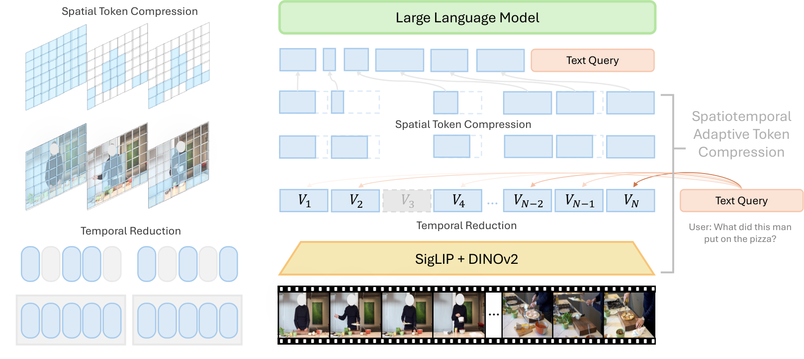</a>

模型结构、时间建模与训练方式

**模型结构：** DINOv2 和 SigLIP 提供互补帧特征。特征融合前，利用 DINO 相似度移除冗余帧。跨模态查询选择对问题而言空间细节重要的帧，其他帧则接受更强的空间池化。额外的跨帧空间压缩去除重复 patch。投影后的 token 进入 Qwen2 或轻量 Llama3.2 解码器，完成视频语言理解。

**时间建模：** 压缩依次在帧之间、帧内部以及重复空间 token 之间进行。根据查询分配预算可保留相关细节，保留下来的有序帧观测支持时间推理。

**训练／推理方式：** 使用 LLaVA-OneVision 图像数据结合图像语言对齐与微调。视频训练使用包括 VideoChat2-IT 在内的公开指令数据集。自适应压缩器在视频语言系统内训练，而非仅依赖均匀帧采样。

**一手资料：** [来源 1](https://arxiv.org/abs/2410.17434) · [来源 2](https://arxiv.org/html/2410.17434)。

---

### TRACE

TRACE 将带时间定位的输出视为因果事件序列，显式结合时间戳、显著性分数和描述，在自回归生成中统一视频时间定位任务。

[论文](https://arxiv.org/abs/2410.05643) · [代码](https://github.com/gyxxyg/TRACE)

**作者：** Yongxin Guo 等  
**首次公开日期：** 2024-10-08（arXiv v1 提交日期（UTC））  
**主要贡献：** 时间建模、结构化解码、训练目标

<a href="assets/architectures/57-paper.png">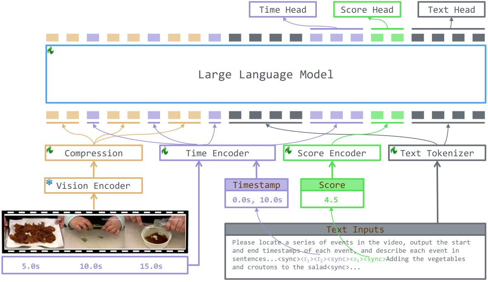</a>

模型结构、时间建模与训练方式

**模型结构：** CLIP 帧特征经过基于槽位的压缩，再与时间戳 token 拼接。独立的编码器和输出头分别表示时间、分数和文本。语言骨干模型由 VideoLLaMA2 初始化，解码结构化事件，而非普通时间戳字符串：每个事件包含边界、可选的相关性分数和描述。因果事件建模使此前的事件影响后续生成。

**时间建模：** 帧时间戳锚定视觉证据，因果事件序列则捕捉多个定位时刻中时间边界、显著性及事件语义之间的依赖关系。

**训练／推理方式：** 首先初始化视觉压缩模块和任务专用的编码器及输出头。随后冻结视觉编码器，微调语言骨干模型和任务模块。混合的时间任务监督教会模型生成结构化事件；可选的下游微调使同一架构适应特定时间定位数据集。

**一手资料：** [来源 1](https://arxiv.org/abs/2410.05643) · [来源 2](https://github.com/gyxxyg/TRACE#model-zoo)。

---

### LLaVA-Video

LLaVA-Video 利用合成的详细描述与问答数据微调具备图像能力的 LLaVA 骨干模型，结合高效帧 token 表示，构建数据驱动的视频助手。

[论文](https://arxiv.org/abs/2410.02713) · [代码](https://github.com/LLaVA-VL/LLaVA-NeXT)

**作者：** Yuanhan Zhang 等  
**首次公开日期：** 2024-10-03（arXiv v1 提交日期）  
**主要贡献：** 指令数据、数据合成、视频表示

<a href="assets/architectures/24-paper.png">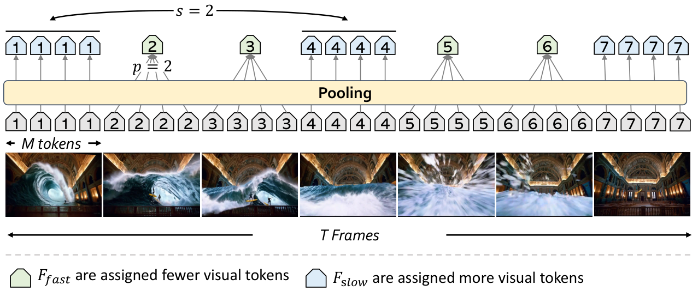</a>

模型结构、时间建模与训练方式

**模型结构：** 模型从经过图像训练的 LLaVA-OneVision 骨干模型出发，包含 SigLIP 视觉特征、轻量投影层和 Qwen2 语言解码器。视频帧表示为有序视觉 token 序列。更新后的论文还研究 SlowFast 输入表示：通过不同的空间池化率，为快路径帧分配较少 token、为慢路径帧分配较多 token，同时避免重复表示同一帧。

**时间建模：** 密集帧采样展示视频进程，可选的 SlowFast 池化在不同帧之间重新分配空间细节。主要提升来自时间维度上细致的视频描述与问答监督。

**训练／推理方式：** 利用 LLaVA-Video-178K 中合成的详细描述、开放式问答和选择题问答，结合已有视觉指令，微调具备图像能力的骨干模型。GPT-4o 提供分层视频描述和问题；这项工作的主要贡献是数据合成。

**资料中提及的数据：** LLaVA-Video-178K、已有混合视觉指令数据。

**版本说明：** 展示的表示方式示意图来自 arXiv v3，用于说明已发表的视频输入选项；条目日期采用最初 v1 的日期。

**一手资料：** [来源 1](https://arxiv.org/abs/2410.02713) · [来源 2](https://arxiv.org/html/2410.02713v3) · [来源 3](https://github.com/LLaVA-VL/LLaVA-NeXT)。

---

### Oryx / 1.5

在指定分辨率与 token 预算下处理图像、视频和多视角场景，在语言解码前结合原生分辨率视觉编码与动态可调的空间压缩。

[论文](https://arxiv.org/abs/2409.12961) · [代码](https://github.com/Oryx-mllm/Oryx)

**作者：** Zuyan Liu 等  
**首次公开日期：** 2024-09-19（arXiv v1 提交日期）  
**主要贡献：** 模型架构、动态分辨率、token 压缩、训练方案

<a href="assets/architectures/35-paper.png">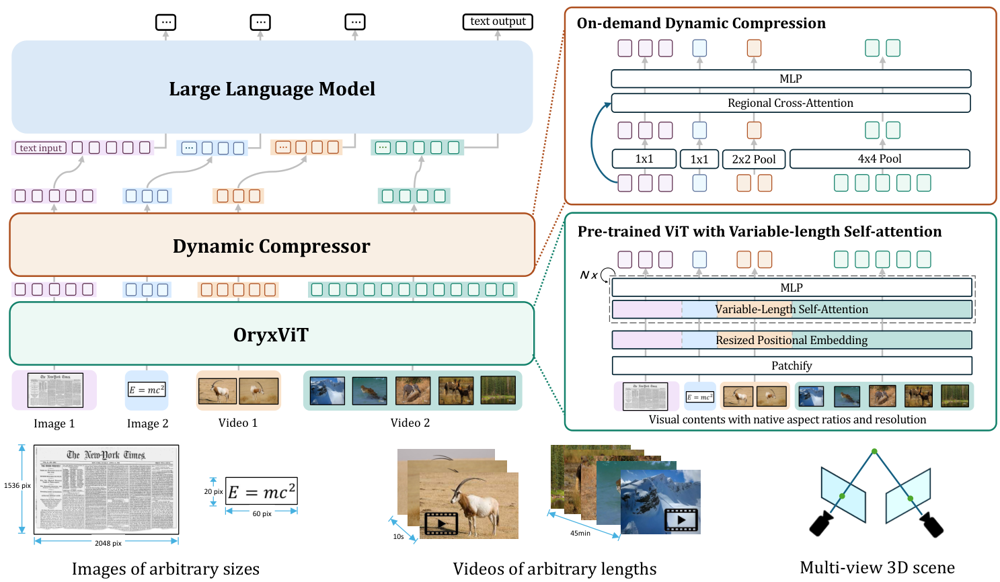</a>

模型结构、时间建模与训练方式

**模型结构：** OryxViT 使用可变长度注意力和自适应位置编码，编码任意分辨率的视觉输入。动态压缩器按可选空间比例池化特征，再以注意力读取原始特征来保留细节，并使用共享 MLP 投影至语言空间。展平后的视觉 token 与文本共同进入各模型权重对应的解码器：Oryx 使用 Qwen2-7B 或 Yi-1.5-34B，Oryx-1.5 使用 Qwen2.5-7B/32B。同一套结构处理静态图像、视频与多视角场景。

**时间建模：** 有序视频帧与可调空间压缩在视觉细节和时间覆盖范围之间进行权衡。长视频监督使模型学习连续性；编码器主要提供原生分辨率的帧表示。

**训练／推理方式：** 图像对齐和监督微调首先训练视觉语言桥接模块。随后联合指令微调混合图像、视频与带空间标注的多视角数据。开源视频指令和合成长视频问答支持广泛的时间覆盖。

**版本说明：** 根据官方仓库，Oryx-1.5 于 2024-10-23 发布。语言骨干模型取决于版本与模型权重规模。

**一手资料：** [来源 1](https://arxiv.org/abs/2409.12961) · [来源 2](https://arxiv.org/html/2409.12961) · [来源 3](https://github.com/Oryx-mllm/Oryx#model-zoo)。

---

### Qwen2-VL

通过时空管块编码与多模态旋转位置编码统一处理可变分辨率的图像和视频，在通用语言模型中显式区分时间与空间坐标。

[论文](https://arxiv.org/abs/2409.12191) · [代码](https://github.com/QwenLM/Qwen2-VL)

**作者：** Peng Wang 等  
**首次公开日期：** 2024-09-18（arXiv v1 提交日期）  
**主要贡献：** 模型架构、位置编码、动态分辨率

<a href="assets/architectures/29-schematic.svg">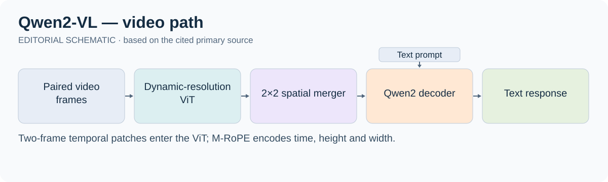</a>

模型结构、时间建模与训练方式

**模型结构：** 动态分辨率 Vision Transformer 使用双帧 3D 时空管块划分来编码图像与视频，其中图像被视为重复的两帧。相邻空间 patch 合并后投影至 Qwen2 语言解码器。生成的可变长度视觉序列与文本混合；M-RoPE 为多模态位置编码分别提供时间、高度和宽度分量。

**时间建模：** M-RoPE 区分帧的时间坐标与空间 patch 位置。双帧时空管块聚合相邻观测，同时在固定视频 token 预算内调整帧分辨率。

**训练／推理方式：** 首先通过图文数据训练视觉组件，再使用混合多模态与文本语料联合更新全部参数。指令微调时冻结视觉编码器，进一步适配语言模型以完成面向用户的任务。

**一手资料：** [来源 1](https://arxiv.org/abs/2409.12191) · [来源 2](https://arxiv.org/html/2409.12191)。

[原论文 M-RoPE 时间机制图](assets/architectures/29-paper.png) · [原始来源与署名](https://arxiv.org/abs/2409.12191)。

---

### LongVILA

通过上下文扩展、长视频指令训练与多模态序列并行扩展长视频理解，将常规视觉语言模型与分布式训练系统结合。

[论文](https://arxiv.org/abs/2408.10188) · [代码](https://github.com/NVlabs/VILA/tree/main/longvila)

**作者：** Yukang Chen 等  
**首次公开日期：** 2024-08-19（arXiv v1 提交日期）  
**主要贡献：** 上下文扩展、训练方案、分布式系统

<a href="assets/architectures/43-paper.png">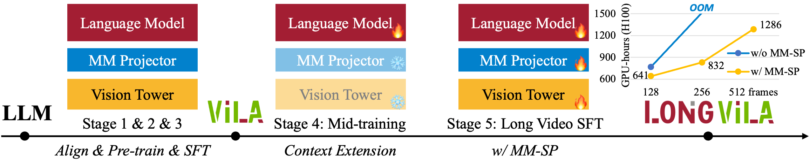</a>

模型结构、时间建模与训练方式

**模型结构：** LongVILA 保留 VILA 的视觉编码器—多模态投影层—语言解码器结构，实验使用 Qwen2 骨干模型。帧 token 占用扩展后的语言上下文，而非经过专门的固定大小视频重采样器。多模态序列并行将长混合序列分片到多个设备，平衡视觉编码与语言注意力的计算，使明显更长的视频输入能够用于训练。

**时间建模：** 有序帧 token 直接由扩展上下文中的语言注意力建模。长视频指令数据训练全局叙事与细节问答，序列并行处理训练成本问题。

**训练／推理方式：** 五个阶段包括多模态对齐、预训练、短输入指令微调、基于文本的上下文扩展和长视频监督微调（SFT）。最终阶段使用 MM-SP 及自动标注的长视频描述和问答任务，更新所有模型参数。

**一手资料：** [来源 1](https://arxiv.org/abs/2408.10188) · [来源 2](https://arxiv.org/html/2408.10188)。

---

### VITA / VITA-1.5

通过模态适配器与共享语言骨干模型实现开放的视频、图像、文本、音频交互；VITA-1.5 随后以渐进式多模态训练整合端到端语音生成。

[论文](https://arxiv.org/abs/2408.05211) · [论文](https://arxiv.org/abs/2501.01957) · [代码](https://github.com/VITA-MLLM/VITA)

**作者：** Chaoyou Fu 等  
**首次公开日期：** 2024-08-09（arXiv v1 提交日期）  
**主要贡献：** 全模态架构、交互系统、训练方案

<a href="assets/architectures/58-paper.png">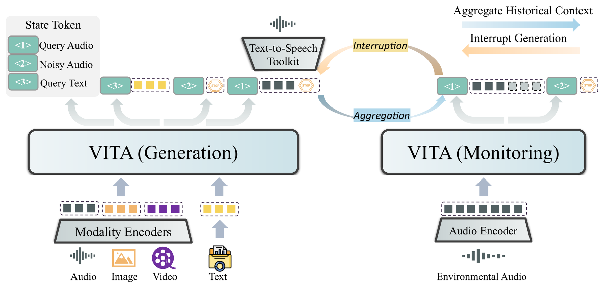</a>

模型结构、时间建模与训练方式

**模型结构：** 初代 VITA 通过独立适配器，将 InternViT 视觉 token 和音频编码器连接至 Mixtral，并使用模态状态 token 及两个模型实例控制交互。VITA-1.5 保留视觉与音频输入适配器，同时加入由语言嵌入直接驱动的语音生成路径，替代早期外部语音合成流程，减少对级联模块的依赖。

**时间建模：** 采样视频帧作为有序视觉 token 输入。音频交互使用专门的状态与打断处理；VITA-1.5 通过直接以嵌入为条件的生成改善语音同步。

**训练／推理方式：** VITA 分阶段进行语言微调、模态对齐与多模态指令微调。VITA-1.5 使用描述、问答、语音转写及文本语音数据，逐步建立视觉语言理解、音频输入与语音输出能力，同时平衡模态冲突。

**版本说明：** 图示来自初代 VITA 报告。VITA-1.5 对语音生成与渐进式训练路径进行了修改，具体见所链接的 1.5 报告。

**一手资料：** [来源 1](https://arxiv.org/abs/2408.05211) · [来源 2](https://arxiv.org/abs/2501.01957) · [来源 3](https://arxiv.org/html/2408.05211)。

---

### LLaVA-OneVision

LLaVA-OneVision 通过 SigLIP、轻量投影层与 Qwen2 统一单图、多图和视频理解，并以分阶段多模态训练促进任务间迁移。

[论文](https://arxiv.org/abs/2408.03326) · [代码](https://github.com/LLaVA-VL/LLaVA-NeXT)

**作者：** Bo Li 等  
**首次公开日期：** 2024-08-06（arXiv v1 提交日期）  
**主要贡献：** 统一架构、任务迁移、训练方案

<a href="assets/architectures/23-paper.png">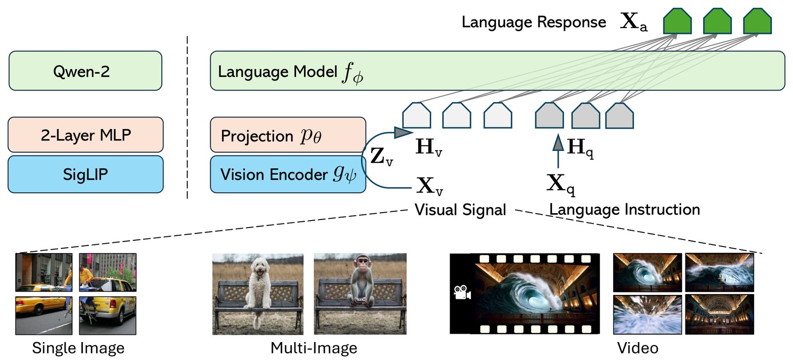</a>

模型结构、时间建模与训练方式

**模型结构：** SigLIP 编码视觉输入，两层 MLP 将网格特征映射到 Qwen2 的 token 嵌入空间。单图使用灵活的 AnyRes 布局，多图和视频帧使用更低的 token 预算。视频输入通过空间插值将每帧压缩为 196 个 token，再按顺序拼接。同一个自回归语言解码器处理全部三类视觉场景。

**时间建模：** 经过空间降采样的帧 token 按顺序进入 LLM。跨场景训练将单图和多图能力迁移到视频时间任务，无需独立学习的时间连接器。

**训练／推理方式：** 依次进行语言—图像对齐、高质量知识学习和视觉指令微调。最后阶段先强化单图指令，再混合单图、多图与视频样本，以促进三类场景之间的能力迁移。

**资料中提及的数据：** LLaVA-OneVision 混合数据、LCS-558K。

**一手资料：** [来源 1](https://arxiv.org/abs/2408.03326) · [来源 2](https://arxiv.org/html/2408.03326v3) · [来源 3](https://github.com/LLaVA-VL/LLaVA-NeXT)。

---

### Tarsier

Tarsier 采用简单的逐帧 CLIP 到 LLM 架构，主要贡献在于大规模多任务训练、人工标注描述及详细视频生成评测。

[论文](https://arxiv.org/abs/2407.00634) · [代码](https://github.com/bytedance/tarsier)

**作者：** Jiawei Wang 等  
**首次公开日期：** 2024-06-30（arXiv v1 提交日期）  
**主要贡献：** 训练方案、指令数据、评测

<a href="assets/architectures/19-paper.png">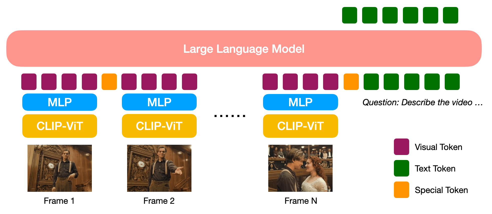</a>

模型结构、时间建模与训练方式

**模型结构：** 冻结的 CLIP ViT 独立编码各采样帧。冻结的 MLP 将帧特征映射到语言模型的 token 空间，并用图像结束 token 分隔连续帧。拼接后的视觉序列输入由 LLaVA-NeXT 初始化的语言模型，进行自回归生成。帧间关系完全由 LLM 处理，架构没有另外加入时间编码器。

**时间建模：** 按顺序排列的帧 token 与图像结束分隔符向语言模型注意力提供序列结构。描述、识别、定位和问答训练帮助模型学习帧之间随时间变化的关系。

**训练／推理方式：** 先进行大规模多任务预训练，再利用中等规模的人工标注详细描述进行指令微调。报告中的 Tarsier 训练始终冻结视觉编码器和 MLP，由 LLM 通过下一 token 预测学习。

**资料中提及的数据：** WebVid、Ego4D、Spoken Moments、Kinetics、Tarsier 人工标注指令数据。

**一手资料：** [来源 1](https://arxiv.org/abs/2407.00634) · [来源 2](https://arxiv.org/html/2407.00634v2) · [来源 3](https://github.com/bytedance/tarsier)。

---

### LongVA

通过仅使用图像的对齐，将扩展后的语言上下文能力迁移至视觉，表明基础模型无需专门的长视频监督也可以获得长视频处理能力。

[论文](https://arxiv.org/abs/2406.16852) · [代码](https://github.com/EvolvingLMMs-Lab/LongVA)

**作者：** Peiyuan Zhang 等  
**首次公开日期：** 2024-06-24（arXiv v1 提交日期）  
**主要贡献：** 上下文扩展、训练方案、语言到视觉迁移

<a href="assets/architectures/41-paper.png">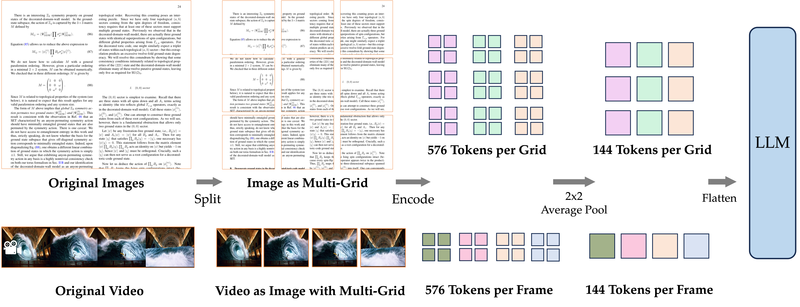</a>

模型结构、时间建模与训练方式

**模型结构：** LongVA 首先扩展 Qwen2-7B 语言骨干模型的上下文。随后，LLaVA 式视觉编码器和投影层将图像与该解码器对齐。UniRes 以一致的视觉编码方案处理图像分块和视频帧：训练图像提供多个网格，推理时复用同一套网格编码方式来表示有序视频帧。空间池化控制每帧 token 数量。

**时间建模：** 长上下文语言注意力聚合有序帧表示。UniRes 尽量减少图像到视频之间的编码差异，使扩展后的语言模型上下文能够接收大量视频帧。

**训练／推理方式：** 使用长文档和调整后的 RoPE 继续进行文本预训练，以扩展上下文。视觉对齐遵循 LLaVA 图像训练方案，并采用短输入训练、长输入测试的设置。可选的偏好微调改善回答，但基础长视频迁移无需视频训练。

**一手资料：** [来源 1](https://arxiv.org/abs/2406.16852) · [来源 2](https://arxiv.org/html/2406.16852)。

---

### VideoLLM-online

VideoLLM-online 通过流式对话目标、带时间戳的监督和连续缓存推理，将常规的帧到语言模型转变为在线助手。

[论文](https://arxiv.org/abs/2406.11816) · [代码](https://github.com/showlab/videollm-online)

**作者：** Joya Chen 等  
**首次公开日期：** 2024-06-17（arXiv v1 提交日期（UTC））  
**主要贡献：** 流式模型、训练目标、数据格式、推理流程

<a href="assets/architectures/45-paper.png">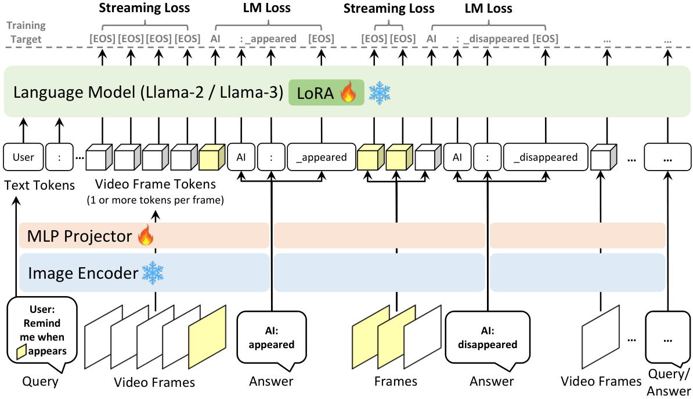</a>

模型结构、时间建模与训练方式

**模型结构：** CLIP ViT-L 独立编码输入帧。紧凑的 CLS 表示及可选的池化空间表示经 MLP 投影层映射到 Llama-2 或 Llama-3。帧 token 和语言 token 按时间顺序进入解码器。视觉编码器并行运行并缓冲帧，语言解码器则维护连续的 KV 缓存，使模型能够在视频流持续输入时作出响应。

**时间建模：** LIVE 预测每个输入帧应触发语言输出还是保持静默。流式 EOS 预测为响应时机提供监督，无需反复追加冗余的对话轮次。

**训练／推理方式：** 以自回归语言损失和流式 EOS 损失训练投影层及配备 LoRA 的 LLM。Ego4D 叙述提供在线监督；离线时间标注被转换为带时间戳的问答序列。论文报告的训练设置中，CLIP 保持冻结。

**资料中提及的数据：** Ego4D Narration Stream、COIN Dialogue Stream。

**一手资料：** [来源 1](https://arxiv.org/abs/2406.11816)。

---

### VideoGPT+

VideoGPT+ 结合互补的图像和视频编码器、分段采样及自适应 token 池化，为对话式视频理解保留空间细节和局部动态。

[论文](https://arxiv.org/abs/2406.09418) · [代码](https://github.com/mbzuai-oryx/VideoGPT-plus)

**作者：** Muhammad Maaz 等  
**首次公开日期：** 2024-06-13（arXiv v1 提交日期）  
**主要贡献：** 模型架构、指令数据、评测基准

<a href="assets/architectures/18-paper.png">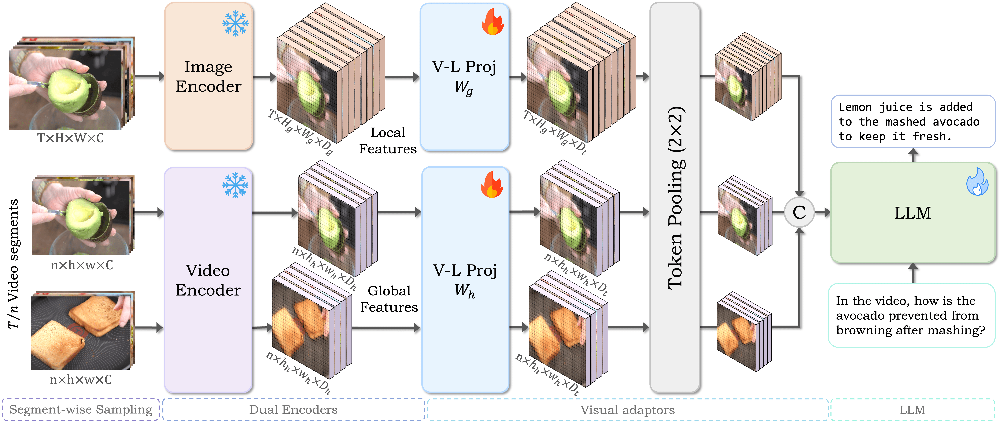</a>

模型结构、时间建模与训练方式

**模型结构：** CLIP 图像编码器捕获细致的外观信息，InternVideo2 视频编码器捕获采样片段内的运动。独立的 MLP 投影层将两类特征映射到语言空间。自适应空间池化控制 token 数量，投影后的图像与视频 token 拼接后，与问题一同输入通过 LoRA 适配的 Phi-3-Mini-3.8B 语言模型。

**时间建模：** 分段采样为视频编码器保留相邻帧组，而非仅使用稀疏、独立的帧。融合表示同时提供局部运动信息与帧级细节。

**训练／推理方式：** 冻结两个编码器与 LLM，在 CC595K 上分两个独立阶段分别预训练图像和视频适配器。随后使用 VideoInstruct-100K、VideoChat2 数据及 VCG+112K 视频指令，联合微调两个适配器和语言模型的 LoRA 参数。

**资料中提及的数据：** VideoInstruct-100K、VideoChat2、VCG+112K。

**一手资料：** [来源 1](https://arxiv.org/abs/2406.09418) · [来源 2](https://arxiv.org/html/2406.09418v1) · [来源 3](https://github.com/mbzuai-oryx/VideoGPT-plus)。

---

### Flash-VStream（STAR Memory）

初代 Flash-VStream 将异步帧处理、问答和 STAR Memory 结合，实现在线视频理解，无需重新编码全部视频历史。

[论文](https://arxiv.org/abs/2406.08085) · [代码](https://github.com/IVGSZ/Flash-VStream/tree/main/Flash-VStream-LLaVA)

**作者：** Haoji Zhang 等  
**首次公开日期：** 2024-06-12（arXiv v1 提交日期（UTC））  
**主要贡献：** 流式模型、记忆架构、异步推理

<a href="assets/architectures/47-paper.png">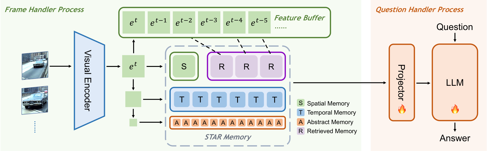</a>

模型结构、时间建模与训练方式

**模型结构：** 帧处理器持续编码视频，并同步更新 STAR Memory 和特征缓冲区。空间、时间、抽象和检索记忆四个组成部分在有界预算内保留互补证据。问题处理器读取最新记忆，投影视觉特征，再调用 LLM。两个进程独立运行，问答期间仍可接收新帧。

**时间建模：** 空间记忆保留近期细节；加权时间聚类概括历史事件，语义注意力更新抽象历史。检索记忆恢复与主要时间聚类最接近的详细帧。

**训练／推理方式：** 训练分为两个阶段：模态对齐阶段冻结视觉和语言骨干模型，训练语义注意力和投影层；指令微调阶段进一步更新 LLM。训练沿用 LLaMA-VID 的图像／视频描述和问答数据。这一 STAR Memory 版本与后续 Flash Memory 模型不同。

**一手资料：** [来源 1](https://arxiv.org/abs/2406.08085) · [来源 2](https://arxiv.org/html/2406.08085v1#S3.SS2)。

---

### VideoLLaMA 2 / 2.1

VideoLLaMA 2 使用时空卷积连接器替代仅基于查询的视频压缩，并加入单独预训练的音频分支，实现联合音视频理解。

[论文](https://arxiv.org/abs/2406.07476) · [代码](https://github.com/DAMO-NLP-SG/VideoLLaMA2) · [代码](https://github.com/DAMO-NLP-SG/VideoLLaMA2/tree/audio_visual)

**作者：** Zesen Cheng 等  
**首次公开日期：** 2024-06-11（arXiv v1 提交日期）  
**主要贡献：** 模型架构、音视频理解

<a href="assets/architectures/12-paper.png">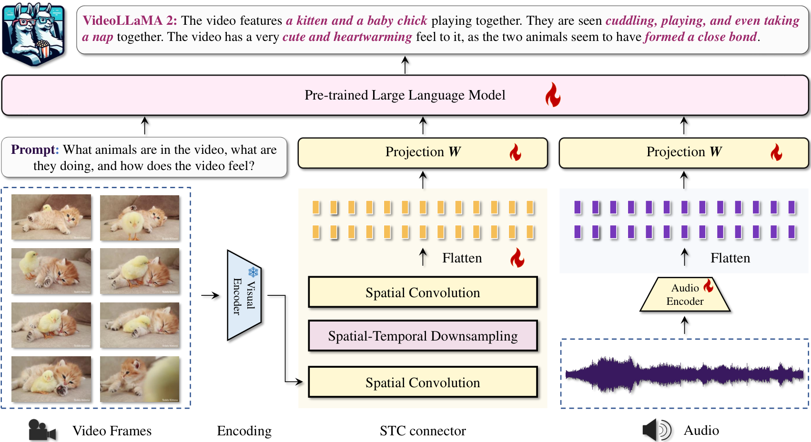</a>

模型结构、时间建模与训练方式

**模型结构：** 逐帧提取的 CLIP ViT-L/14 特征进入 STC 连接器，其中空间交互模块与带步长的 3D 卷积负责时间和空间聚合。输出 token 送入遵循指令的 LLM。音频分支将声音转为频谱图，使用 BEATs 提取特征，再经过两层 MLP。报告中的语言骨干模型包括 Mistral、Mixtral 和 Qwen2；后续检查点的编码器与骨干配置有所不同。

**时间建模：** STC 连接器在 LLM 之前学习局部空间交互与跨帧聚合。BEATs 提供包含时间信息的声学特征，跨模态推理则在语言解码器中进行。

**训练／推理方式：** 在编码器与 LLM 冻结的情况下分别预训练视觉和音频连接器，随后进行各模态的多任务微调。最后使用音视频指令联合训练以整合两个分支；骨干模型的选择应与具体发布的检查点对应。

**资料中提及的数据：** Panda-70M、VIDAL-10M、WebVid-10M、InternVid-10M、CC3M、DCI。

**一手资料：** [来源 1](https://arxiv.org/abs/2406.07476) · [来源 2](https://arxiv.org/html/2406.07476v3) · [来源 3](https://github.com/DAMO-NLP-SG/VideoLLaMA2) · [来源 4](https://github.com/DAMO-NLP-SG/VideoLLaMA2/tree/audio_visual)。

---

### VideoStreaming

VideoStreaming 将可复用的流式视频编码与问答分离，结合跨片段传播的记忆和由问题引导的选择，以紧凑表示处理长视频。

[论文](https://arxiv.org/abs/2405.16009)

**作者：** Rui Qian 等  
**首次公开日期：** 2024-05-25（arXiv v1 提交日期（UTC））  
**主要贡献：** 记忆架构、检索、训练方案

<a href="assets/architectures/46-paper.png">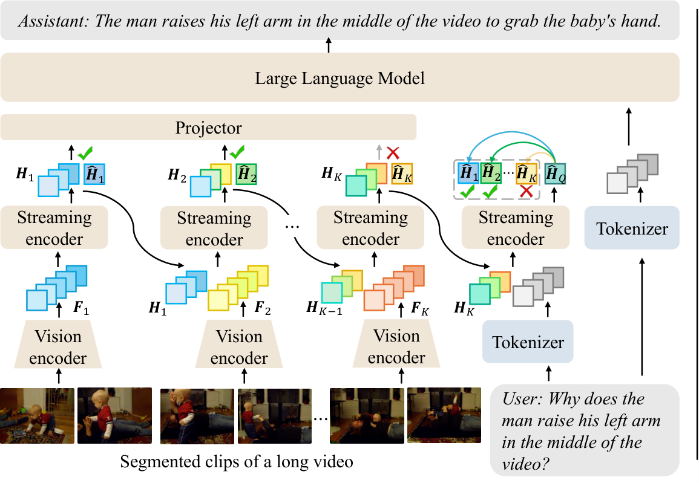</a>

模型结构、时间建模与训练方式

**模型结构：** CLIP 帧特征经过空间合并后，被投影到小型 Phi-2 语言模型。可学习的摘要 token 在融入前序片段记忆的同时压缩当前片段。历史片段表示独立于问题存储。Adaptive Memory Selection 检索相关时间点，再由第二个投影层将选出的记忆 token 送入 Vicuna，完成问答和推理。

**时间建模：** 记忆传播将早期片段的上下文带入后续表示。由问题引导的记忆选择恢复相关历史片段的细节，同时保留它们的时间顺序。

**训练／推理方式：** 首先对齐单片段投影层，并在图像和短视频任务上训练紧凑编码器。随后在长视频问答任务上联合训练流式编码、选择模块和回答问题的 LLM；选择模块先用伪时间标签预热，再接受弱监督。

**公开情况：** 初步核查中，未核实到由作者链接的公开实现。

**一手资料：** [来源 1](https://arxiv.org/abs/2405.16009)。

---

### VTG-LLM

VTG-LLM 将时间戳知识注入视觉输入和文本输出，结合显式时间嵌入与基于槽位的压缩，用于视频时间定位及相关任务。

[论文](https://arxiv.org/abs/2405.13382) · [代码](https://github.com/gyxxyg/VTG-LLM)

**作者：** Yongxin Guo 等  
**首次公开日期：** 2024-05-22（arXiv v1 提交日期（UTC））  
**主要贡献：** 时间建模、时间嵌入、token 压缩、指令数据

<a href="assets/architectures/56-paper.png">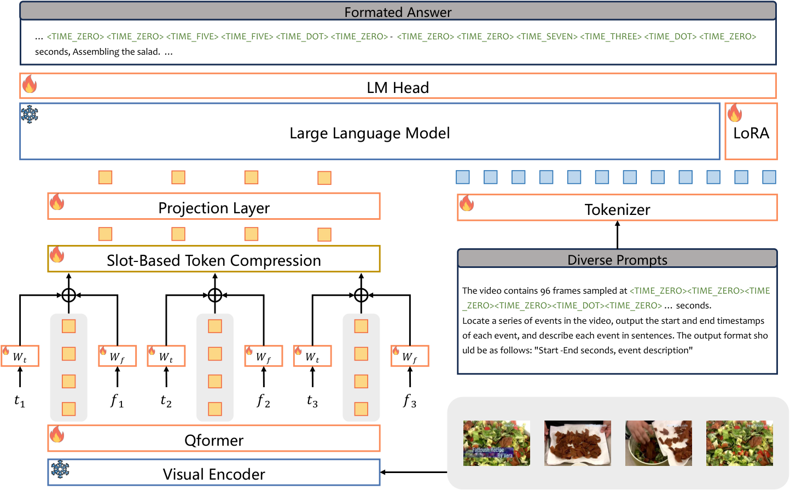</a>

模型结构、时间建模与训练方式

**模型结构：** 固定的视觉编码器和 Q-Former 提取帧 token。Sequence-time embeddings 将帧顺序和绝对时间戳同时加入视觉表示。基于槽位的 token 压缩在进入语言解码器之前，将随帧数增长的 token 序列映射到固定预算。特殊的绝对时间 token 编码提示和答案中的时间戳字符，使视频证据与生成的时间边界采用共用表示。

**时间建模：** Sequence-time embeddings 区分时间先后顺序与绝对时间。专用时间 token 使生成的时间戳显式化，而压缩在固定 token 预算内保留有用信息。

**训练／推理方式：** 使用 VTG-IT-120K 时间感知指令和采样的 Valley 子集训练，覆盖时间定位、密集描述和精彩片段检测。从预训练视觉语言组件初始化，按论文的指令训练设置微调时间模块和语言适配部分。

**资料中提及的数据：** VTG-IT-120K、Valley 子集。

**一手资料：** [来源 1](https://arxiv.org/abs/2405.13382)。

---

### LLaVA-NeXT-Video

LLaVA-NeXT-Video 将经过图像训练的视觉—语言架构迁移到多帧输入，再通过指令微调、上下文扩展和直接偏好优化改进视频理解。

[技术来源](https://llava-vl.github.io/blog/2024-04-30-llava-next-video/) · [代码](https://github.com/LLaVA-VL/LLaVA-NeXT)

**作者：** Yuanhan Zhang 等  
**首次公开日期：** 2024-04-30（官方博客发布日期）  
**主要贡献：** 图像到视频迁移、训练方案、偏好优化

<a href="assets/architectures/22-project.png">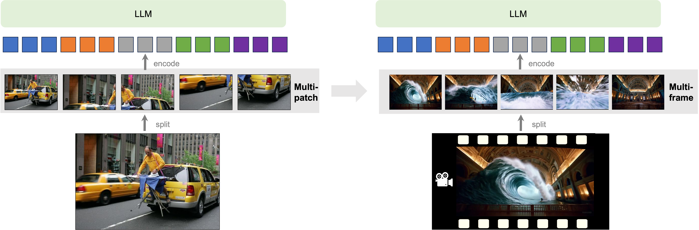</a>

模型结构、时间建模与训练方式

**模型结构：** LLaVA-NeXT 的预训练视觉编码器将其 AnyRes 多裁剪图像表示扩展到多帧特征提取。投影后的视觉 token 组成语言解码器的输入序列，空间池化控制视频 token 的增长。官方报告比较图像模型的零样本迁移、经过视频监督的检查点，以及 DPO 改进后的模型，并使用线性位置缩放扩展推理上下文。

**时间建模：** 以帧序列替代图像裁剪，使语言模型能够学习或推断时间关系。空间池化与上下文长度缩放支持更长序列的处理。

**训练／推理方式：** 从仅使用图像训练的 LLaVA-NeXT 检查点出发，在混合图像和视频指令数据上微调；还可利用 AI 对视频回答的反馈进行 DPO。官方技术来源是作者于 2024 年 4 月发布的博客。

**资料中提及的数据：** Video-ChatGPT、LLaVA 图像指令、视频偏好数据。

**一手资料：** [来源 1](https://llava-vl.github.io/blog/2024-04-30-llava-next-video/) · [来源 2](https://github.com/LLaVA-VL/LLaVA-NeXT)。

---

### PLLaVA

PLLaVA 通过无参数的自适应池化将图像训练的 LLaVA 扩展到视频，平滑占主导的视觉特征并保留帧顺序，用于生成详细视频描述。

[论文](https://arxiv.org/abs/2404.16994) · [代码](https://github.com/magic-research/PLLaVA)

**作者：** Lin Xu 等  
**首次公开日期：** 2024-04-25（arXiv v1 提交日期）  
**主要贡献：** 模型架构、无新增参数池化

<a href="assets/architectures/10-paper.png">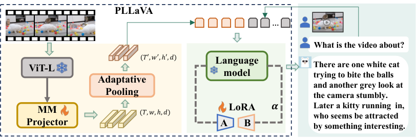</a>

模型结构、时间建模与训练方式

**模型结构：** 预训练 CLIP ViT-L 图像编码器与多模态投影层将采样视频编码为时间×空间的特征网格。自适应平均结构池化先压缩该网格，再展平并与文本嵌入拼接。带有可训练 LoRA 适配器的 LLaVA-NeXT 语言解码器生成回答。池化连接器本身不增加参数，投影层和语言适配器则需要训练。

**时间建模：** 池化可以沿时间和空间维度进行；论文报告的默认设置保留 16 帧，并将空间网格池化到 12×12，时间推理由 LLM 完成。

**训练／推理方式：** 从已发布的 LLaVA-NeXT 图像模型权重初始化，利用视频指令微调多模态投影层和 LLM 的 LoRA 参数。论文研究数据与模型规模、池化方案及后续优化，以改善密集描述质量和稳定性。

**一手资料：** [来源 1](https://arxiv.org/abs/2404.16994) · [来源 2](https://arxiv.org/html/2404.16994v2) · [来源 3](https://github.com/magic-research/PLLaVA)。

---

### MA-LMM

为查询 Transformer 加入容量受限的视觉记忆与查询记忆，按序处理视频，并保留历史证据以支持基于语言的长期理解和对话。

[论文](https://arxiv.org/abs/2404.05726) · [代码](https://github.com/boheumd/MA-LMM)

**作者：** Bo He 等  
**首次公开日期：** 2024-04-08（arXiv v1 提交日期）  
**主要贡献：** 记忆架构、顺序处理

<a href="assets/architectures/39-paper.png">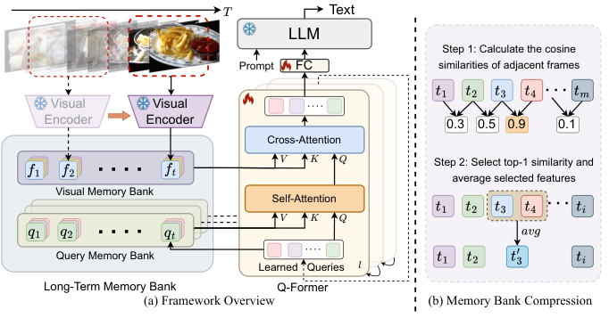</a>

模型结构、时间建模与训练方式

**模型结构：** 冻结的视觉编码器提取每个新输入帧的特征。可训练的 Q-Former 维护两个记忆库，分别保存历史视觉特征与先前查询状态。其注意力同时读取这些记忆和当前观测，投影层将查询连接至冻结的语言模型。该框架基于 InstructBLIP，支持 Vicuna 或 Flan-T5 解码器。

**时间建模：** 记忆库压缩在固定容量下合并相似历史条目。序列更新沿时间传递视觉信息与潜在查询信息，无需将每一帧拼接进 LLM。

**训练／推理方式：** 使用预训练图像语言组件初始化。任务特定训练更新 Q-Former 与投影层，同时保持骨干模型冻结。实验覆盖视频推理、问答、描述生成及直接应用的记忆扩展，展示记忆机制的迁移能力。

**一手资料：** [来源 1](https://arxiv.org/abs/2404.05726) · [来源 2](https://arxiv.org/html/2404.05726)。

---

### LongVLM

结合压缩后的局部视频片段与全局语义特征，在保持短事件顺序的同时，为语言模型提供紧凑的长视频表示。

[论文](https://arxiv.org/abs/2404.03384) · [代码](https://github.com/ziplab/LongVLM)

**作者：** Yuetian Weng 等  
**首次公开日期：** 2024-04-04（arXiv v1 提交日期）  
**主要贡献：** 模型架构、token 压缩、全局／局部表示

<a href="assets/architectures/40-paper.png">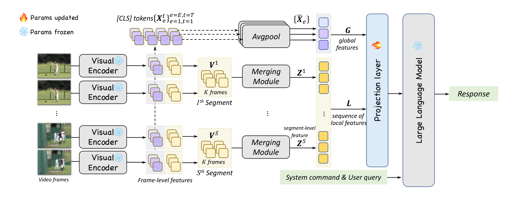</a>

模型结构、时间建模与训练方式

**模型结构：** CLIP-ViT-L/14 从多个深度提取帧 patch 特征与 class token。每个时间片段内的分层 token 合并生成紧凑局部特征。全局 class token 特征概括更广范围的视频，两种表示按时间顺序组合。线性投影层将视频表示映射至从 LLaVA 初始化并冻结的 Vicuna-7B 解码器。

**时间建模：** 片段表示保留时间顺序，分层合并去除局部冗余。全局语义特征为语言模型的时间理解补充覆盖整段视频的上下文。

**训练／推理方式：** 使用 Video-ChatGPT 视频指令学习线性视觉语言投影层。预训练 CLIP 编码器与 Vicuna 保持冻结。轻量微调设置用于检验局部聚合与全局语义信息结合所带来的收益。

**一手资料：** [来源 1](https://arxiv.org/abs/2404.03384) · [来源 2](https://arxiv.org/html/2404.03384)。

---

### MiniGPT4-Video

MiniGPT4-Video 在 MiniGPT-v2 基础上按时间顺序交错输入帧与字幕 token，在语言模型的上下文窗口内结合视觉证据和转录文本。

[论文](https://arxiv.org/abs/2404.03413) · [代码](https://github.com/Vision-CAIR/MiniGPT4-video)

**作者：** Kirolos Ataallah 等  
**首次公开日期：** 2024-04-04（arXiv v1 提交日期）  
**主要贡献：** 模型架构、字幕集成

<a href="assets/architectures/08-paper.png">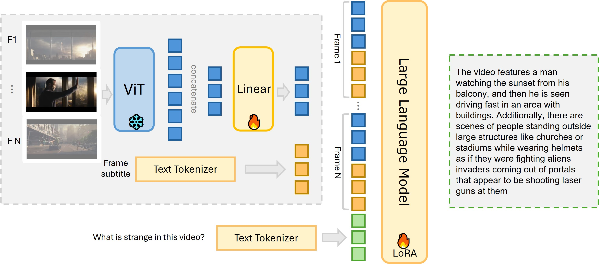</a>

模型结构、时间建模与训练方式

**模型结构：** 冻结的 EVA-CLIP 编码每一帧。每组 4 个相邻图像块 token 先拼接，再通过线性投影层转换为语言空间中的视觉 token，每帧得到 64 个。字幕文本经过分词后放在对应帧之后。最终交错排列的视觉—文本序列与问题一同交给 Llama-2 或 Mistral 语言骨干模型。

**时间建模：** 时间结构来自按顺序交错排列的帧与字幕。对齐字幕提供相应的语音内容，视觉压缩则使有限上下文窗口能够容纳更多帧。

**训练／推理方式：** 训练分为三个阶段：图像—描述对齐、在 VideoDB／WebVid 上进行大规模视频—描述预训练，以及视频问答指令微调。EVA-CLIP 保持冻结，模型学习线性投影层，并使用 LoRA 适配语言模型。

**资料中提及的数据：** LAION、Conceptual Captions、SBU、VideoDB、WebVid、Video-ChatGPT。

**一手资料：** [来源 1](https://arxiv.org/abs/2404.03413) · [来源 2](https://arxiv.org/html/2404.03413v1) · [来源 3](https://github.com/Vision-CAIR/MiniGPT4-video)。

---

### ST-LLM

ST-LLM 将时空视觉 token 直接输入语言模型，利用动态掩码与全局—局部输入，在时间学习能力和效率之间取得平衡。

[论文](https://arxiv.org/abs/2404.00308) · [代码](https://github.com/TencentARC/ST-LLM)

**作者：** Ruyang Liu 等  
**首次公开日期：** 2024-03-30（arXiv v1 提交日期）  
**主要贡献：** 模型架构、时间学习

<a href="assets/architectures/09-paper.png">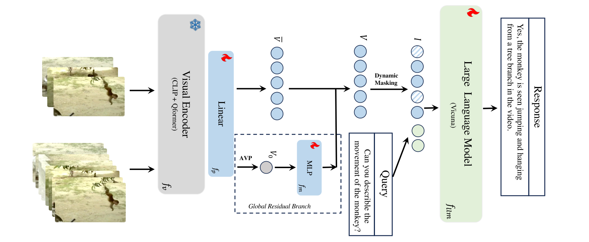</a>

模型结构、时间建模与训练方式

**模型结构：** 由 InstructBLIP 初始化的视觉编码器和 Q-Former 将每帧编码为紧凑的空间 token。线性投影层将完整的帧 token 序列映射到 Vicuna-v1.1-7B，由语言模型直接学习帧间关系。动态掩码降低训练时视觉序列的开销；推理时，全局—局部输入模块将细致的局部帧与覆盖全视频的上下文结合。

**时间建模：** 时间依赖在 LLM 注意力内部学习，无需先压缩到视频级瓶颈表示。掩码与非掩码输入之间的一致性学习，以及全局—局部特征，提高了模型面对不同视频长度时的稳健性。

**训练／推理方式：** 从图像对话模型出发，进行单阶段视频指令微调。冻结视觉编码器与 Q-Former，微调语言模型，并在多样化视频指令上结合自回归监督与论文提出的掩码目标。

**资料中提及的数据：** VideoInstruct-100K、VideoChat、WebVid、NExT-QA、CLEVRER、Kinetics-710、Something-Something-V2。

**一手资料：** [来源 1](https://arxiv.org/abs/2404.00308) · [来源 2](https://arxiv.org/html/2404.00308v1) · [来源 3](https://github.com/TencentARC/ST-LLM)。

---

### InternVideo2（MLLM 分支）

InternVideo2 的对话分支将渐进预训练的视频基础编码器接入 LLM，在独立表征模型的基础上增加查询压缩与指令微调。

[论文](https://arxiv.org/abs/2403.15377) · [代码](https://github.com/OpenGVLab/InternVideo/tree/main/InternVideo2)

**作者：** Yi Wang 等  
**首次公开日期：** 2024-03-22（arXiv v1 提交日期）  
**主要贡献：** 视频编码器、MLLM 集成、多模态预训练

<a href="assets/architectures/14-paper.png">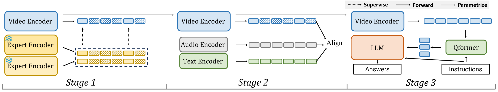</a>

模型结构、时间建模与训练方式

**模型结构：** InternVideo2 的大规模视频 Transformer 提供通过视频 token 重建和多模态对比训练学习的时空特征。对话阶段将该编码器连接到 BLIP 风格的 Q-Former 和开放语言模型。高清后训练增加局部视频裁剪与全局缩放视图，视觉查询将这些特征压缩为兼容语言模型的输入，用于对话生成。

**时间建模：** 基础编码器联合建模多帧。高清后训练结合全局和局部视频视图，并增加输入帧数，以改善细粒度时间和空间证据。

**训练／推理方式：** 首先通过未掩码 token 重建学习视频表示，再使用多模态对比目标训练。第三阶段加入用于对话的下一 token 预测。额外的高清指令训练更新视频编码器与 Q-Former，并通过 LoRA 适配 LLM。

**资料中提及的数据：** K-Mash、InternVid、InternVid2、WebVid、LLaVA／视频混合指令数据。

**一手资料：** [来源 1](https://arxiv.org/abs/2403.15377) · [来源 2](https://arxiv.org/html/2403.15377v4) · [来源 3](https://github.com/OpenGVLab/InternVideo/tree/main/InternVideo2)。

---

### HawkEye

HawkEye 通过面向时间定位的指令和递归裁剪扩展 VideoChat2，将粗粒度时间选择逐步细化为精确视频片段，同时保留通用视频对话能力。

[论文](https://arxiv.org/abs/2403.10228) · [代码](https://github.com/yellow-binary-tree/HawkEye)

**作者：** Yueqian Wang 等  
**首次公开日期：** 2024-03-15（arXiv v1 提交日期（UTC））  
**主要贡献：** 时间建模、指令数据、递归推理

<a href="assets/architectures/55-paper.png">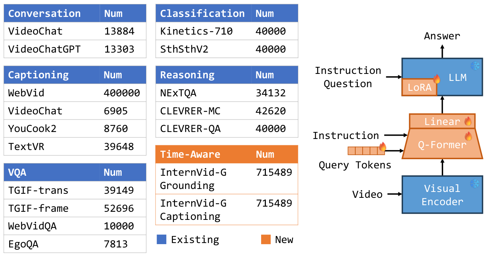</a>

模型结构、时间建模与训练方式

**模型结构：** HawkEye 保留 VideoChat2 的视觉编码器、Q-Former、查询 token 和语言解码器。它将定位格式化为四种粗粒度时间选择：开头、中间、结尾或全程。推理时，递归定位裁剪选中的时间区域并再次提问，逐步缩小片段范围。最终边界被映射回原视频的时间戳，作为用户可见输出。

**时间建模：** 粗粒度时间类别避免直接生成时间戳时的脆弱性。递归裁剪反复提高时间分辨率，随机训练裁剪则改变每个查询的相对位置。

**训练／推理方式：** 将 InternVid-G 时间定位和片段描述指令加入 VideoChat2 指令数据。冻结视觉编码器，微调 Q-Former 和查询 token，并对 LLM 应用 LoRA。随机裁剪平衡时间类别，并减少模型利用问题措辞与答案之间的捷径。

**资料中提及的数据：** InternVid-G、VideoChat2-IT。

**一手资料：** [来源 1](https://arxiv.org/abs/2403.10228)。

---

### Momentor

Momentor 引入连续的时间 token 空间和带定位信息的事件序列训练，以支持片段级视频理解、时间定位及多事件推理。

[论文](https://arxiv.org/abs/2402.11435) · [代码](https://github.com/DCDmllm/Momentor)

**作者：** Long Qian 等  
**首次公开日期：** 2024-02-18（arXiv v1 提交日期（UTC））  
**主要贡献：** 时间建模、时间 token、训练目标、指令数据

<a href="assets/architectures/54-paper.png">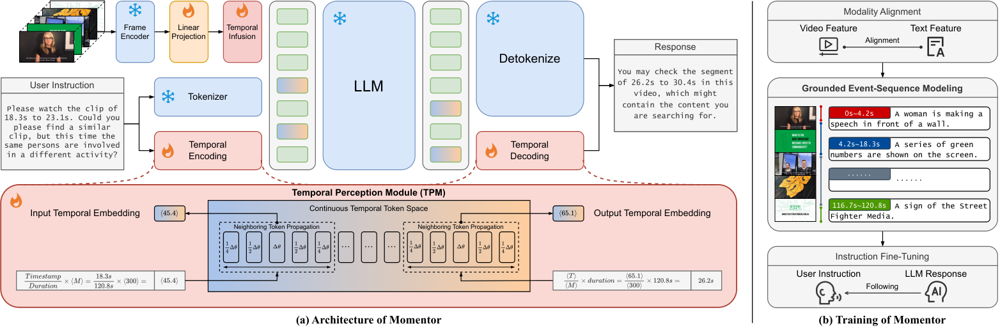</a>

模型结构、时间建模与训练方式

**模型结构：** CLIP 独立编码采样帧，线性投影层将它们与 LLaMA 对齐。Temporal Perception Module 用时间 token 扩展词表，并将时间信息注入帧表示。连续插值表示离散 token 之间的时间戳，相邻 token 传播则约束它们的嵌入。解码器同时生成时间边界和语言，以同一接口支持带定位信息的描述及跨片段指令遵循。

**时间建模：** 插值时间嵌入减小时间戳量化误差。Grounded Event-Sequence Modeling 将有序事件描述与边界关联，而相邻 token 更新促使时间表示保持连续。

**训练／推理方式：** 在 Moment-10M 上依次进行模态对齐、带定位信息的事件序列建模和指令微调。论文报告的实现冻结 CLIP 和 LLaMA-7B 骨干模型，更新投影层和时间模块。片段级与跨片段指令提供比单纯视频级问答更细粒度的时间推理监督。

**资料中提及的数据：** Moment-10M。

**一手资料：** [来源 1](https://arxiv.org/abs/2402.11435)。

---

### TimeChat

TimeChat 将帧内容与显式时间戳关联，并产生可变长度的视频 token，使自然语言指令能够统一支持时间定位、密集描述和精彩片段检测。

[论文](https://arxiv.org/abs/2312.02051) · [代码](https://github.com/RenShuhuai-Andy/TimeChat)

**作者：** Shuhuai Ren 等  
**首次公开日期：** 2023-12-04（arXiv v1 提交日期（UTC））  
**主要贡献：** 时间建模、Q-Former 连接器、指令数据

<a href="assets/architectures/52-paper.png">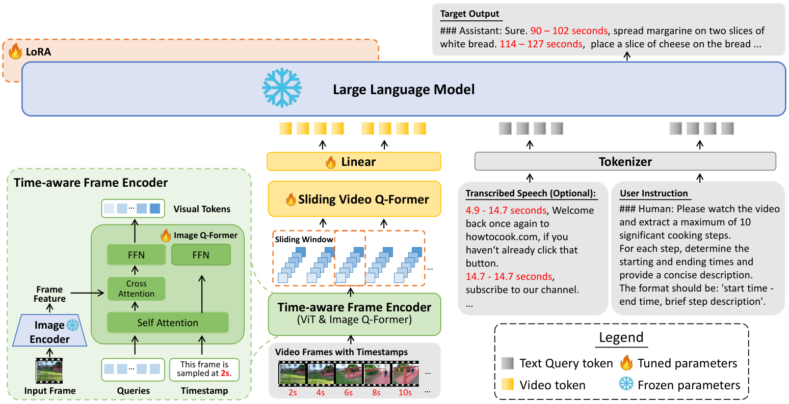</a>

模型结构、时间建模与训练方式

**模型结构：** 时间戳感知帧编码器通过图像 Q-Former，将每帧的视觉特征与时间戳描述绑定。滑动视频 Q-Former 在连续窗口内聚合这些帧 token。其可变长度输出经投影后，与查询及可选的语音转写文本一起送入 LLaMA-2 解码器。模型随后以文本形式生成描述和带时间戳的时间预测。

**时间建模：** 时间戳描述将帧级证据锚定到绝对时间；滑动 Q-Former 建模局部时间关系，并使 token 序列长度随视频时长变化。

**训练／推理方式：** 从预训练视觉语言组件初始化，再对 Q-Former 和投影层进行指令微调，并使用 LoRA 适配 LLM。TimeIT 为多种视频任务提供时间感知监督。训练对答案使用语言建模目标，使定位和描述共用同一解码过程。

**资料中提及的数据：** TimeIT。

**一手资料：** [来源 1](https://arxiv.org/abs/2312.02051)。

---

### VTimeLLM

VTimeLLM 主要通过分阶段监督建立时间边界感知能力，将简单的视觉编码器和投影层与语言解码器结合，用于带时间戳的事件理解。

[论文](https://arxiv.org/abs/2311.18445) · [代码](https://github.com/huangb23/VTimeLLM)

**作者：** Bin Huang 等  
**首次公开日期：** 2023-11-30（arXiv v1 提交日期（UTC））  
**主要贡献：** 时间建模、训练课程、指令数据

<a href="assets/architectures/53-paper.png">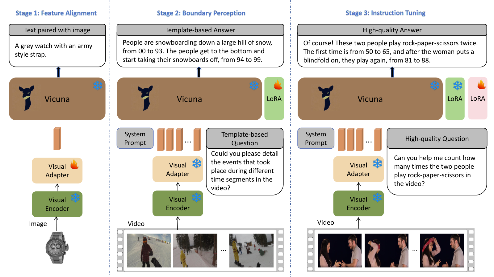</a>

模型结构、时间建模与训练方式

**模型结构：** 冻结的 CLIP 帧编码器为每个均匀采样帧提取特征，视觉适配器将该序列映射到 Vicuna 的嵌入空间。视觉 token 与用户问题共同进入自回归 LLM。架构采用轻量连接；核心创新是边界感知训练课程，通过文本答案教会模型生成事件描述和时间区间。

**时间建模：** 100 个采样帧构成有序的视频表示。单轮和多轮时间问答将事件与相对边界关联，使模型能够进行时间定位和密集描述。

**训练／推理方式：** 先用图文对对齐视觉适配器；再利用大规模多事件视频数据和边界感知问答训练 LLM 的 LoRA 模块；最后在高质量对话上进行指令微调。第二阶段冻结已对齐的适配器，使时间学习与初始视觉对齐分开进行。

**一手资料：** [来源 1](https://arxiv.org/abs/2311.18445)。

---

### LLaMA-VID

使用以指令为条件的上下文 token 与池化内容 token 表示视频帧，显著缩短长视频输入，同时为语言生成保留问题相关视觉线索。

[论文](https://arxiv.org/abs/2311.17043) · [代码](https://github.com/JIA-Lab-research/LLaMA-VID)

**作者：** Yanwei Li 等  
**首次公开日期：** 2023-11-28（arXiv v1 提交日期）  
**主要贡献：** 模型架构、问题条件化、token 压缩

<a href="assets/architectures/38-paper.png">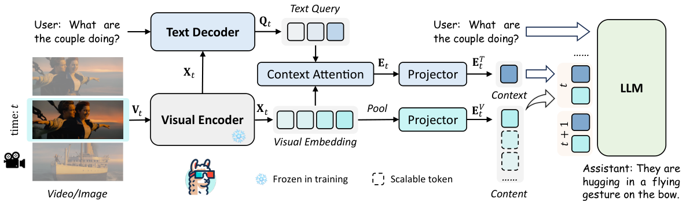</a>

模型结构、时间建模与训练方式

**模型结构：** 视觉编码器提取帧 patch，BERT 或 Q-Former 等文本解码器构造以指令为条件的查询。上下文注意力选择相关视觉证据，并将其投影为上下文 token。自适应池化提供描述帧的内容 token。两者共同进入 Vicuna 家族解码器；双 token 设置为每帧使用一个上下文 token 和一个内容 token。

**时间建模：** 经过查询引导的压缩后，帧仍保持时间顺序。内容 token 预算可配置，因此所介绍的双 token 表示对应一种具体设置，并非适用于所有输入。

**训练／推理方式：** 模态对齐使用图像与视频描述学习上下文注意力和投影层。指令微调更新多模态接口与语言模型。长视频微调使用电影问题和字幕，使系统扩展至小时级叙事。

**一手资料：** [来源 1](https://arxiv.org/abs/2311.17043) · [来源 2](https://arxiv.org/html/2311.17043)。

---

### VideoChat2

VideoChat2 将经过时间信息预训练的 UMT 视觉编码器、指令感知的查询压缩与渐进训练相结合，是随 MVBench 一同提出的强基线模型。

[论文](https://arxiv.org/abs/2311.17005) · [代码](https://github.com/OpenGVLab/Ask-Anything/tree/main/video_chat2)

**作者：** Kunchang Li 等  
**首次公开日期：** 2023-11-28（arXiv v1 提交日期）  
**主要贡献：** 模型架构、训练方案、评测基准

<a href="assets/architectures/11-paper.png">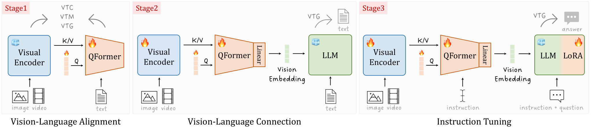</a>

模型结构、时间建模与训练方式

**模型结构：** UMT-L 编码器提取包含时空上下文的视频帧特征。Q-Former 通过可学习查询压缩大量视觉特征，指令条件引导其选择相关证据。投影后的查询 token 进入 Vicuna 语言骨干模型，由 LoRA 适配语言生成。模型将视觉压缩与语言推理分开，并通过渐进训练完成连接，而非直接接入未经训练的投影层。

**时间建模：** UMT 视频编码器在查询压缩之前提供时间特征。覆盖多种任务的指令训练模型感知、排序、定位并推理不断变化的视觉事件。

**训练／推理方式：** 采用三个阶段：对齐 UMT-L 与 Q-Former、将二者的表示接入 LLM，以及指令微调。后续阶段适配视觉编码器与 Q-Former；语言侧通过 LoRA 适配，骨干模型保持冻结。

**资料中提及的数据：** VideoChat2 混合指令数据：来自 34 个来源的 2M 个样本。

**一手资料：** [来源 1](https://arxiv.org/abs/2311.17005) · [来源 2](https://arxiv.org/html/2311.17005v4) · [来源 3](https://github.com/OpenGVLab/Ask-Anything/tree/main/video_chat2)。

---

### Video-LLaVA

Video-LLaVA 使用 LanguageBind 在共享投影层之前对齐图像和视频表示，使同一个 Vicuna 模型能够围绕两种视觉模态进行对话。

[论文](https://arxiv.org/abs/2311.10122) · [代码](https://github.com/PKU-YuanGroup/Video-LLaVA)

**作者：** Bin Lin 等  
**首次公开日期：** 2023-11-16（arXiv v1 提交日期）  
**主要贡献：** 模型架构、图像视频联合训练

<a href="assets/architectures/06-paper.png">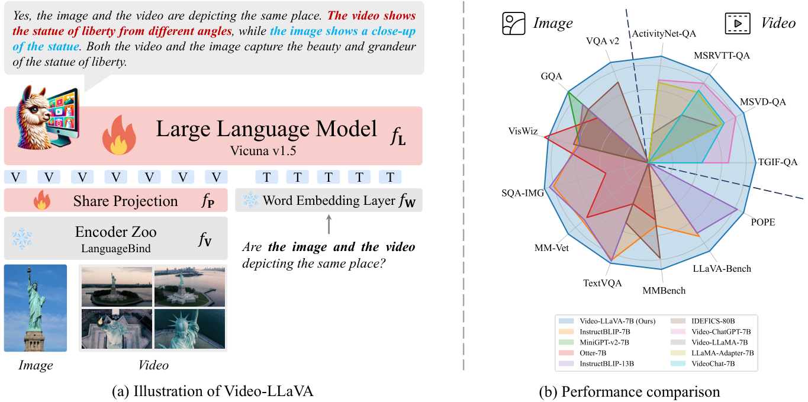</a>

模型结构、时间建模与训练方式

**模型结构：** LanguageBind 图像与视频编码器提取的特征已通过共享文本表示空间完成对齐。带有 GELU 的共享两层 MLP 将这些特征映射到 Vicuna-7B-v1.5 的嵌入空间。投影后的视觉 token 与经过分词的指令拼接，用于自回归生成，使语言模型从统一的视觉表示中学习，而非面对互不关联的编码器空间。

**时间建模：** LanguageBind 视频编码器从均匀采样的 8 帧中提供时间特征；共享投影层为 LLM 保留视频 token 序列。

**训练／推理方式：** 首先在混合的图像／视频—描述批次上训练投影层，同时冻结骨干模型。随后利用 LLaVA-1.5 图像指令和 Video-ChatGPT 视频指令联合微调投影层与 LLM，视觉编码器继续保持冻结。

**资料中提及的数据：** LCS-558K、Valley WebVid 子集、LLaVA-1.5-665K、VideoInstruct-100K。

**一手资料：** [来源 1](https://arxiv.org/abs/2311.10122) · [来源 2](https://arxiv.org/html/2311.10122v3) · [来源 3](https://github.com/PKU-YuanGroup/Video-LLaVA)。

---

### Chat-UniVi

Chat-UniVi 利用动态 token 聚类和多尺度聚合，将图像与视频压缩为统一的视觉序列，交给对话语言模型处理。

[论文](https://arxiv.org/abs/2311.08046) · [代码](https://github.com/PKU-YuanGroup/Chat-UniVi)

**作者：** Peng Jin 等  
**首次公开日期：** 2023-11-14（arXiv v1 提交日期）  
**主要贡献：** 模型架构、token 压缩

<a href="assets/architectures/07-paper.png">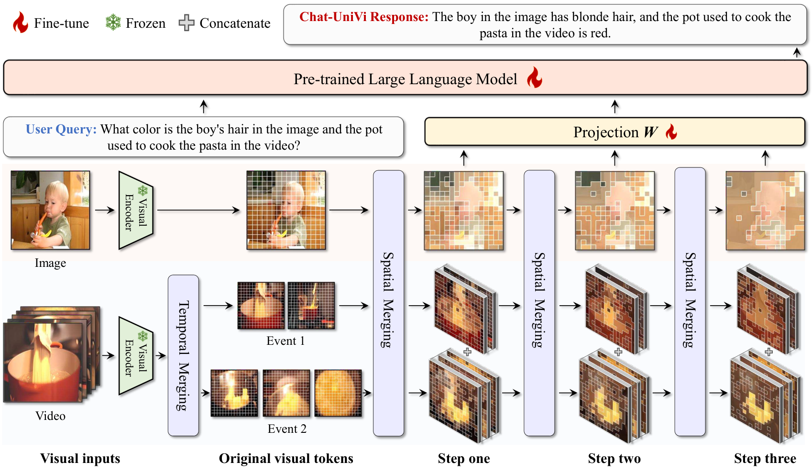</a>

模型结构、时间建模与训练方式

**模型结构：** CLIP ViT-L/14 提供图像块 token。结合近邻的密度峰值聚类合并空间上冗余的 token，并将帧划分为事件组。同一个事件内的视觉 token 可以跨越多帧。三步聚合构建互补的细节与语义尺度，拼接后通过线性投影层输入 Vicuna-v1.5-7B，再处理对话并生成文本。

**时间建模：** 帧聚类确定事件组，token 只在同一事件内合并，最终视觉 token 按事件顺序排列以保留时间关系。

**训练／推理方式：** 首先使用 COCO 和 CC3M 图像描述只训练投影层完成对齐，冻结视觉与语言骨干模型。随后利用 LLaVA、MIMIC-IT 和 Video-ChatGPT 的图像、多图像及视频指令，联合微调投影层与 LLM。

**资料中提及的数据：** COCO、CC3M-595K、LLaVA、MIMIC-IT、VideoInstruct-100K。

**一手资料：** [来源 1](https://arxiv.org/abs/2311.08046) · [来源 2](https://arxiv.org/html/2311.08046v3) · [来源 3](https://github.com/PKU-YuanGroup/Chat-UniVi)。

---

### MovieChat

将密集帧 token 转换为短期与长期记忆，使视频语言助手在可控的语言输入长度内保留更长的视觉历史。

[论文](https://arxiv.org/abs/2307.16449) · [代码](https://github.com/wenhaochai/MovieChat)

**作者：** Enxin Song 等  
**首次公开日期：** 2023-07-31（arXiv v1 提交日期）  
**主要贡献：** 记忆架构、token 压缩、评测基准

<a href="assets/architectures/37-paper.png">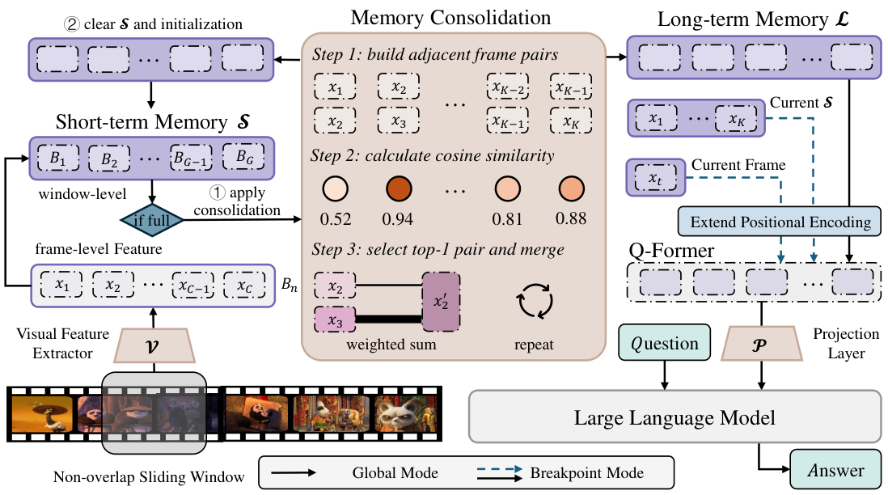</a>

模型结构、时间建模与训练方式

**模型结构：** EVA-CLIP 与 BLIP-2 图像 Q-Former 在滑动窗口内生成帧表示。密集 token 进入短期缓冲区，再整合为稀疏长期记忆。视频 Q-Former 和线性投影层将选中的记忆映射至语言模型。全局模式与断点模式分别为整段视频问答或特定已观测时刻选择表示。

**时间建模：** 基于相似度的整合在保持时间顺序的同时合并冗余的相邻记忆。分层结构保留近期细节和压缩后的历史，扩展了常规帧拼接之外的视频覆盖范围。

**训练／推理方式：** MovieChat 复用源自 Video-LLaMA 的预训练视觉语言组件，报告重点是基于记忆的处理。MovieChat-1K 提供包含全局与断点问题的长视频评测。记忆层次结构本身没有建立新的大规模预训练方案。

**一手资料：** [来源 1](https://arxiv.org/abs/2307.16449) · [来源 2](https://arxiv.org/html/2307.16449)。

---

### Valley

Valley 在 CLIP 帧编码后加入时间聚合和语言投影层，通过两阶段对齐与指令微调统一图像和视频对话。

[论文](https://arxiv.org/abs/2306.07207) · [代码](https://github.com/RupertLuo/Valley)

**作者：** Ruipu Luo 等  
**首次公开日期：** 2023-06-12（arXiv v1 提交日期）  
**主要贡献：** 模型架构、指令数据

<a href="assets/architectures/05-paper.png">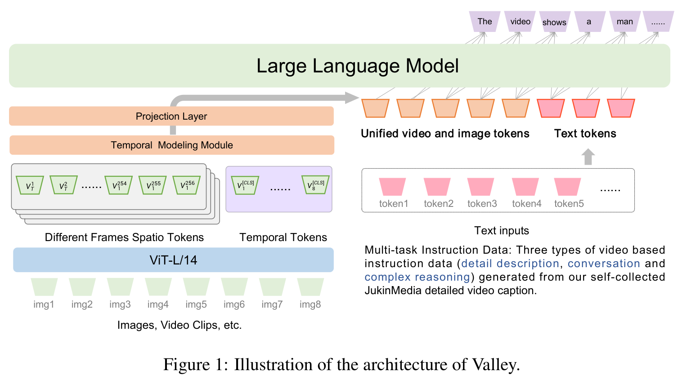</a>

模型结构、时间建模与训练方式

**模型结构：** CLIP ViT-L/14 从采样帧中提取图像块特征与全局特征。时间模块融合不同帧中对应空间位置的特征，同时保留帧级全局 token 作为补充。投影层将统一的视觉 token 映射到 StableVicuna-13B 的嵌入空间。论文比较了平均池化、可学习的加权池化，以及基于 Transformer 的时间聚合三种方案。

**时间建模：** 三种时间聚合方案逐步加入帧重要性和时间变化建模；Transformer 方案将从序列中提取的特征与经过平均池化的空间表示结合。

**训练／推理方式：** 首先利用 CC3M 图像—描述数据和 Valley-702K 视频—描述对训练投影层。随后使用 Valley-instruct-73K、LLaVA 和 VideoChat 指令联合微调投影层与 LLM，视觉骨干模型保持冻结。

**资料中提及的数据：** CC3M-595K、Valley-702K、Valley-instruct-73K、LLaVA、VideoChat。

**一手资料：** [来源 1](https://arxiv.org/abs/2306.07207) · [来源 2](https://arxiv.org/html/2306.07207v3) · [来源 3](https://github.com/RupertLuo/Valley)。

---

### Video-ChatGPT

Video-ChatGPT 将 CLIP 帧特征转换为空间和时间 token，再学习一个线性接口，将其接入冻结的 Vicuna 对话语言模型。

[论文](https://arxiv.org/abs/2306.05424) · [代码](https://github.com/mbzuai-oryx/Video-ChatGPT)

**作者：** Muhammad Maaz 等  
**首次公开日期：** 2023-06-08（arXiv v1 提交日期）  
**主要贡献：** 模型架构、指令数据、评测

<a href="assets/architectures/03-paper.png">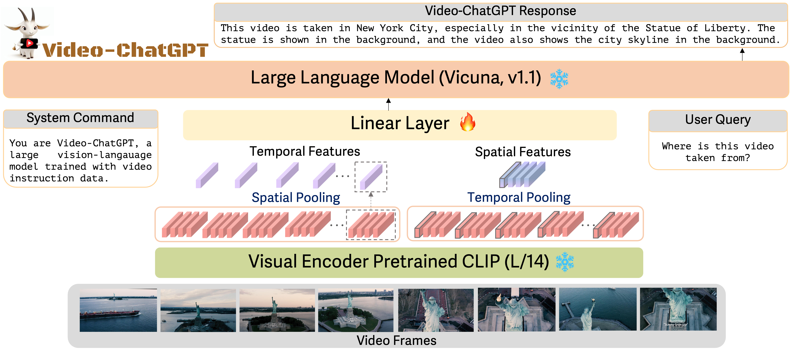</a>

模型结构、时间建模与训练方式

**模型结构：** 冻结的 CLIP ViT-L/14 从每个采样帧中提取空间 token 网格。沿时间维度求平均得到空间 token，沿空间位置求平均则为每一帧生成一个时间 token。模型拼接这两类表示，通过可训练的线性投影层映射到由 LLaVA 初始化的 Vicuna-v1.1-7B，并与用户指令一同输入语言模型。

**时间建模：** 分别对空间和时间维度求平均以压缩视频。按帧顺序排列的时间 token 为语言模型保留序列信息，无需学习独立的视频编码器。

**训练／推理方式：** 在 VideoInstruct-100K 上进行自回归回答预测，数据包含人工辅助标注和半自动标注。视频指令微调只更新线性投影层，CLIP 视觉编码器与 Vicuna 语言模型均保持冻结。

**资料中提及的数据：** VideoInstruct-100K。

**一手资料：** [来源 1](https://arxiv.org/abs/2306.05424) · [来源 2](https://arxiv.org/html/2306.05424v2) · [来源 3](https://github.com/mbzuai-oryx/Video-ChatGPT)。

---

### Video-LLaMA

Video-LLaMA 为冻结的语言模型加入独立的视觉和音频查询接口，结合帧聚合与基于 ImageBind 的跨模态对齐，实现视频对话。

[论文](https://arxiv.org/abs/2306.02858) · [代码](https://github.com/DAMO-NLP-SG/Video-LLaMA)

**作者：** Hang Zhang 等  
**首次公开日期：** 2023-06-05（arXiv v1 提交日期）  
**主要贡献：** 模型架构、音视频理解

<a href="assets/architectures/04-paper.png">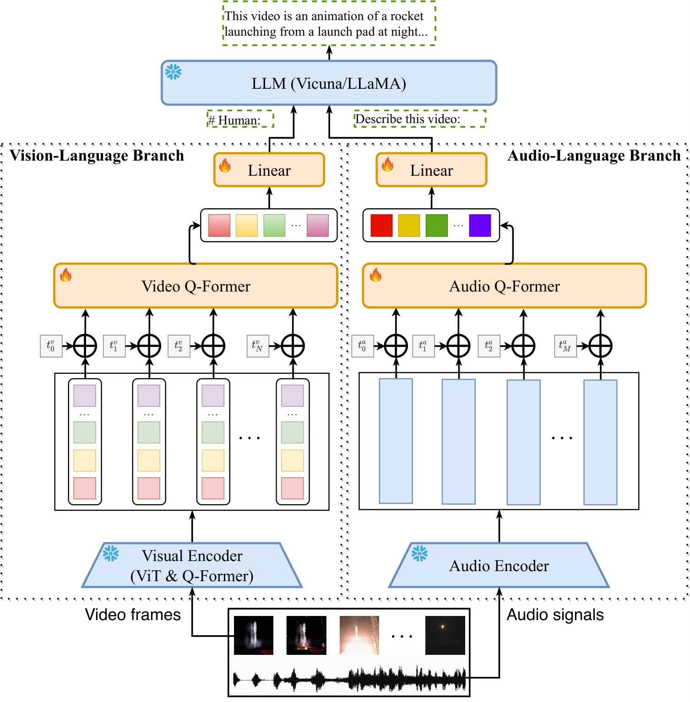</a>

模型结构、时间建模与训练方式

**模型结构：** 视觉分支使用冻结的图像编码器和帧级 Q-Former，加入帧位置嵌入后，通过 Video Q-Former 和线性投影层聚合多帧信息。音频分支从音频片段中提取 ImageBind 特征，加入位置嵌入并经过 Audio Q-Former，最后将查询表示投影到同一个冻结 LLM 的输入空间。

**时间建模：** 位置嵌入区分采样帧与音频片段。两个独立的查询 Transformer 分别将各模态聚合为固定长度序列，再将特征送入 LLM。

**训练／推理方式：** 先在 WebVid-2M 和 CC595K 上训练视觉接口，再利用 MiniGPT-4、LLaVA 和 VideoChat 指令进一步微调。音频接口借助 ImageBind 的共享嵌入空间使用视觉—文本监督，而非直接进行音频—文本训练。

**资料中提及的数据：** WebVid-2M、CC595K、MiniGPT-4、LLaVA、VideoChat。

**一手资料：** [来源 1](https://arxiv.org/abs/2306.02858) · [来源 2](https://arxiv.org/html/2306.02858v4) · [来源 3](https://github.com/DAMO-NLP-SG/Video-LLaMA)。

---

### VideoChat

VideoChat 同时提供端到端视频嵌入接口和基于文本的并行处理流程，通过轻量适配将视频感知与对话式语言生成连接起来。

[论文](https://arxiv.org/abs/2305.06355) · [代码](https://github.com/OpenGVLab/Ask-Anything)

**作者：** KunChang Li 等  
**首次公开日期：** 2023-05-10（arXiv v1 提交日期）  
**主要贡献：** 模型架构、指令数据、系统设计

<a href="assets/architectures/02-paper.png">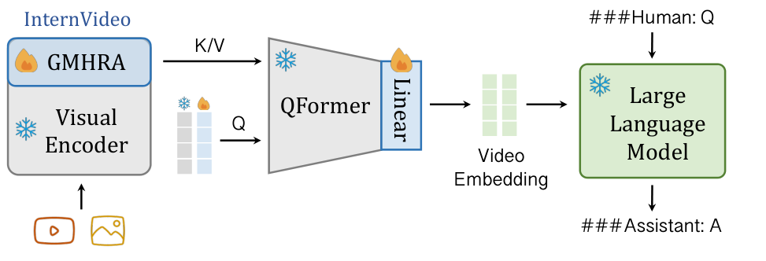</a>

模型结构、时间建模与训练方式

**模型结构：** VideoChat-Embed 在预训练 ViT-G 图像编码器中加入 Global Multi-Head Relation Aggregator 模块以处理时间信息。BLIP-2 Q-Former、额外的可学习查询和线性投影层共同生成供 StableVicuna 使用的紧凑输入。VideoChat-Text 则将动作预测、视频描述、密集描述及字幕转换为结构化文本提示，交给 LLM 处理。

**时间建模：** 嵌入分支在视觉编码器内部学习时间聚合；文本分支先将带有时间索引的感知结果序列化，再由语言模型进行推理。

**训练／推理方式：** 首先使用大规模图像／视频—描述数据对齐视频与语言接口，再利用详细视频描述和对话微调时间模块、额外查询与投影层。这一轻量的两阶段训练方案始终冻结大部分预训练参数。

**资料中提及的数据：** WebVid、VideoChat 指令数据。

**一手资料：** [来源 1](https://arxiv.org/abs/2305.06355) · [来源 2](https://arxiv.org/html/2305.06355v2) · [来源 3](https://github.com/OpenGVLab/Ask-Anything)。

---

### Flamingo

Flamingo 通过 Perceiver Resampler 和门控交叉注意力连接冻结的视觉、语言骨干模型，实现对交错排列的图像、视频和文本的少样本理解。

[论文](https://arxiv.org/abs/2204.14198) · [作者论文](https://storage.googleapis.com/deepmind-media/DeepMind.com/Blog/tackling-multiple-tasks-with-a-single-visual-language-model/flamingo.pdf)

**作者：** Jean-Baptiste Alayrac 等  
**首次公开日期：** 2022-04-29（arXiv v1 提交日期）  
**主要贡献：** 模型架构、多模态预训练、少样本学习

<a href="assets/architectures/01-paper.png">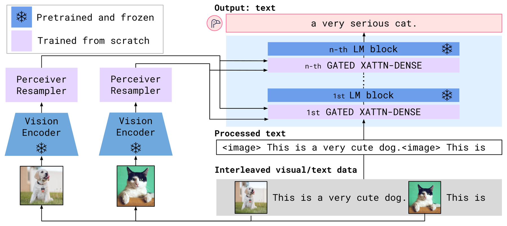</a>

模型结构、时间建模与训练方式

**模型结构：** 冻结的 NFNet-F6 将采样帧编码为空间特征。模型先加入可学习的时间嵌入，再由 Perceiver Resampler 为每张图像或每段视频生成 64 个视觉 token。新训练的门控交叉注意力和前馈模块插入冻结的 Chinchilla 语言模型层之间。文本查询读取此前最近一次出现的视觉输入，语言自注意力则传递更早的上下文。

**时间建模：** 以每秒 1 帧的频率独立编码各帧；时间嵌入与 Resampler 在语言生成前聚合这些帧的时空特征网格。

**训练／推理方式：** 在交错排列的网页内容、图像—描述对和视频—描述对上，通过下一 token 预测训练 Resampler 与新增的交叉注意力模块。视觉和语言骨干模型保持冻结；下游少样本评测通过提示词提供示例。

**资料中提及的数据：** M3W、ALIGN、LTIP、VTP。

**公开情况：** 原始 Flamingo 的权重和实现未公开发布。社区复现不标记为作者官方代码。

**一手资料：** [来源 1](https://arxiv.org/abs/2204.14198) · [来源 2](https://arxiv.org/html/2204.14198v2) · [来源 3](https://storage.googleapis.com/deepmind-media/DeepMind.com/Blog/tackling-multiple-tasks-with-a-single-visual-language-model/flamingo.pdf)。

---

## 方法与系统

本节介绍作用于既有模型的 KV 缓存检索、token 压缩、时间边界修正，以及智能体与记忆系统。图示说明各方法在整体流程中的作用位置。

### StreamMeCo

StreamMeCo 压缩智能体的长期记忆图，并优先选择近期相关证据，在不改变视觉语言骨干模型的情况下降低流式视频理解的检索成本。

[论文](https://arxiv.org/abs/2604.09000) · [代码](https://github.com/Celina-love-sweet/StreamMeCo)

**作者：** Junxi Wang 等  
**首次公开日期：** 2026-04-10（arXiv v1 提交日期（UTC））  
**主要贡献：** 智能体记忆方法、图记忆压缩、时间检索

<a href="assets/architectures/68-paper.png">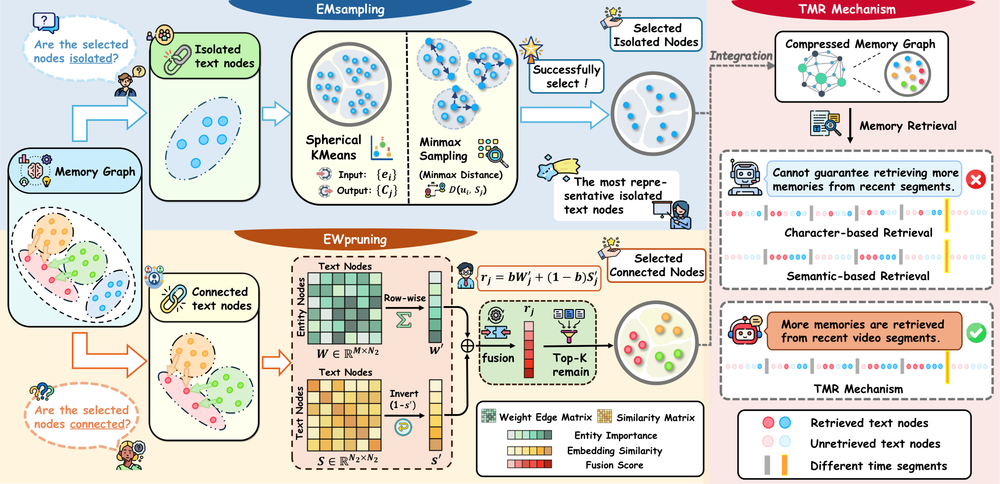</a>

模型结构、时间建模与训练方式

**模型结构：** StreamMeCo 应用于基于记忆的视频智能体 M3-Agent，在感知证据进入图之后运行。Edge-free Minmax Sampling（EMsampling）压缩孤立节点，Edge-aware Weighting Pruning（EWpruning）依据重要性和相似度信号移除价值较低的连接节点。Time-decay Memory Retrieval（TMR）通过时间衰减重新加权查询匹配。保留并检索到的图证据随后支持原智能体的语言模型推理。

**时间建模：** 时间戳感知衰减在检索时优先选择近期相关记忆；图压缩限制持续增长的历史存储，同时保留早期观察中与实体相关的重要证据。

**训练／推理方式：** 所提出的压缩和检索流程无需新增模型训练。它们操作已有智能体生成的记忆图，采样、剪枝和衰减参数在评测中选择。贡献位于智能体记忆层，而非新的视频编码器。

**一手资料：** [来源 1](https://arxiv.org/abs/2604.09000) · [来源 2](https://arxiv.org/html/2604.09000v1)。

---

### FlashVID

FlashVID 无需训练即可压缩视频 token，结合基于注意力与多样性的选择，以及基于树的时空合并，在有限的语言模型输入预算内保留代表性证据。

[论文](https://arxiv.org/abs/2602.08024) · [代码](https://github.com/Fanziyang-v/FlashVID)

**作者：** Ziyang Fan 等  
**首次公开日期：** 2026-02-08（arXiv v1 提交日期（UTC））  
**主要贡献：** 免训练方法、token 选择、时空合并

<a href="assets/architectures/69-paper.png">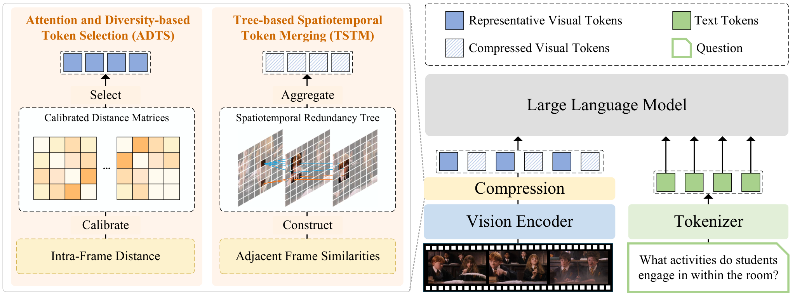</a>

模型结构、时间建模与训练方式

**模型结构：** 预训练 Video-LLM 的视觉编码器首先生成帧 token。Attention and Diversity-based Token Selection 利用校准后的注意力和特征多样性，选择信息丰富且多样的代表性 token。Tree-based Spatiotemporal Token Merging 随后通过跨越空间和时间的受约束冗余树，对冗余特征分组。压缩后的 token 序列进入原连接器和 LLM，使骨干模型在保持不变的情况下，可在 token 预算内处理更多帧。

**时间建模：** 合并考虑跨帧的空间变化，而非仅匹配相同位置。树深度与宽度约束限制时间跨度，并保留视频的局部动态。

**训练／推理方式：** 无需额外训练。选择与合并利用已有视觉特征和注意力信号，并保留预训练权重。论文在 LLaVA-OneVision、LLaVA-Video 和 Qwen2.5-VL 上评测该方法，说明它是可复用的推理模块，而非新的模型检查点。

**一手资料：** [来源 1](https://arxiv.org/abs/2602.08024)。

---

### ReKV

ReKV 是一种无需训练的推理方法，将流式视频的 KV 状态存储在 GPU 显存之外，并在问题到来时检索相关状态。

[论文](https://arxiv.org/abs/2503.00540) · [代码](https://github.com/Becomebright/ReKV)

**作者：** Shangzhe Di 等  
**首次公开日期：** 2025-03-01（arXiv v1 提交日期（UTC））  
**主要贡献：** 免训练方法、KV 缓存检索、流式推理

<a href="assets/architectures/65-paper.png">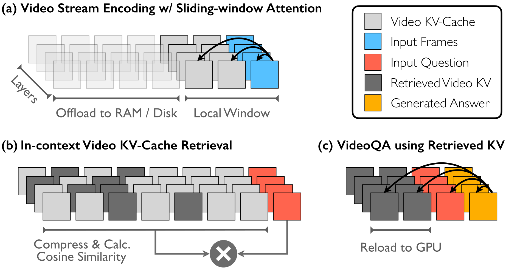</a>

模型结构、时间建模与训练方式

**模型结构：** 预训练的基于解码器的 Video-LLM 使用滑动窗口注意力，对视频流编码一次。离开活动窗口的视频 KV 状态被卸载到内存或磁盘。查询通过余弦相似度检索相关的缓存键和值，压缩表示加速这一过程。检索到的状态被送回 GPU 显存，为自回归答案生成提供上下文，避免重复编码视频。

**时间建模：** 滑动窗口在编码过程中捕捉局部时间上下文；带索引的历史 KV 块保留早期视频区域的证据，供问题引导的检索与复用。

**训练／推理方式：** 无需额外训练。ReKV 在推理期间修改注意力、缓存存储和检索，同时复用预训练 Video-LLM 权重。实验将该方法接入已有的支持视频的骨干模型；它是一种缓存管理方法，而非单独训练的模型。

**一手资料：** [来源 1](https://arxiv.org/abs/2503.00540)。

---

### StreamChat（Xiong 等）

Xiong 等人的 StreamChat 是无需训练的记忆编排框架，结合分层视频证据和对话历史，支持流式理解与多轮交互。

[论文](https://arxiv.org/abs/2501.13468) · [代码](https://github.com/hmxiong/StreamChat)

**作者：** Haomiao Xiong 等  
**首次公开日期：** 2025-01-23（arXiv v1 提交日期（UTC））  
**主要贡献：** 免训练系统、层次化记忆、检索、评测基准

<a href="assets/architectures/66-paper.png">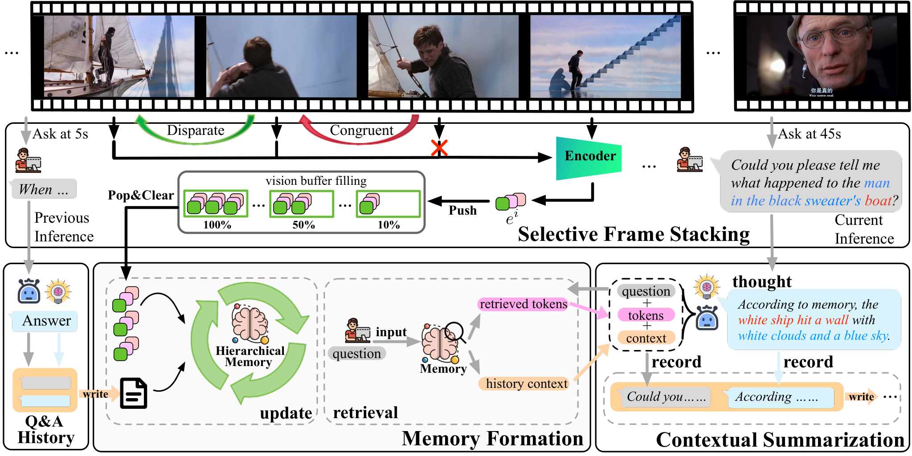</a>

模型结构、时间建模与训练方式

**模型结构：** Selective Frame Stacking 编码并缓冲信息丰富的视觉特征。Memory Formation 将它们组织为近期短期记忆、长期记忆树和对话记忆。Contextual Summarization 检索与问题相关的证据，并为已有 MLLM 构建上下文。并行调度将帧处理与交互分开，使系统在回答用户问题时仍能继续积累记忆。

**时间建模：** 短期记忆跟踪正在发生的事件，分层长期记忆压缩较早的视频。检索到的对话历史支持围绕不同时间区域的多轮问答保持连续性。

**训练／推理方式：** 无需额外训练。框架复用预训练视觉语言模型和基于嵌入的检索，在其外围引入存储、压缩、摘要和调度。这一记忆系统及其 StreamBench 贡献，与 Liu 等人单独训练的 StreamChat 交叉注意力架构不同。

**资料中提及的数据：** StreamBench（评测）。

**一手资料：** [来源 1](https://arxiv.org/abs/2501.13468)。

---

### TimeRefine

TimeRefine 通过先生成粗略边界、再迭代预测偏移量，改进已有的时间定位 Video-LLM；辅助输出头进一步惩罚定位误差。

[论文](https://arxiv.org/abs/2412.09601) · [代码](https://github.com/SJTUwxz/TimeRefine_code)

**作者：** Xizi Wang 等  
**首次公开日期：** 2024-12-12（arXiv v1 提交日期（UTC））  
**主要贡献：** 可插拔训练方法、迭代解码、辅助训练目标

<a href="assets/architectures/67-paper.png">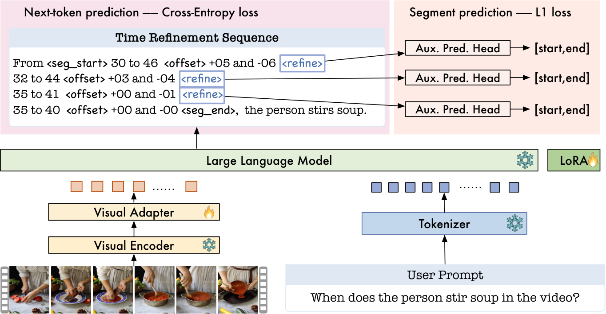</a>

模型结构、时间建模与训练方式

**模型结构：** 该方法保留所接入 Video-LLM 的视觉编码器、连接器和语言解码器，并在 VTimeLLM 和 VTG-LLM 上进行验证。它将解码器输出改为初始时间区间，后接细化预测和偏移量。辅助回归头在训练期间补充下一 token 预测头。最终区间和偏移量得到定位片段，在不替换原架构的情况下提高时间精度。

**时间建模：** 迭代残差偏移量细化粗略预测。辅助 L1 目标区分接近正确边界的预测与偏离较远的错误，而常规 token 分类无法直接表达这种差异。

**训练／推理方式：** 该方法需要训练。通过逐步减小的时间戳噪声，将定位问答目标转换为细化序列；非定位目标保持不变。沿用所接入模型原有的训练数据和设置，并增加下一 token 预测与辅助回归监督。

**一手资料：** [来源 1](https://arxiv.org/abs/2412.09601)。

---

### SlowFast-LLaVA

SlowFast-LLaVA 无需微调即可将图像训练的 LLaVA-NeXT 扩展到视频，在固定 token 预算内结合稀疏的细节帧与密集的空间池化帧。

[论文](https://arxiv.org/abs/2407.15841) · [代码](https://github.com/apple-aiml-research/ml-slowfast-llava)

**作者：** Mingze Xu 等  
**首次公开日期：** 2024-07-22（arXiv v1 提交日期（UTC））  
**主要贡献：** 免训练方法、双速率输入、空间池化

<a href="assets/architectures/70-paper.png">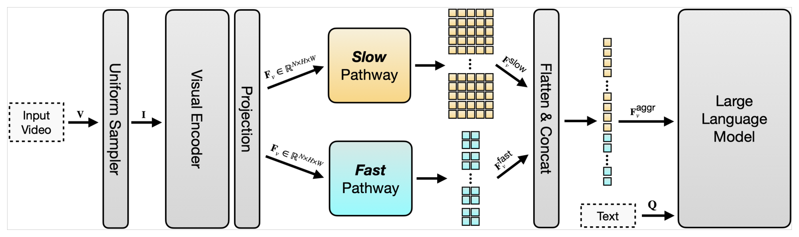</a>

模型结构、时间建模与训练方式

**模型结构：** 现有图像编码器独立提取均匀采样帧的特征。慢速路径保留较少的帧及详细的空间 token。快速路径保留更多帧，但使用更强的空间池化。聚合后的视觉表示配合面向视频的提示，送入保持不变的 LLaVA-NeXT 连接器和解码器，显式权衡空间细节与时间覆盖范围。

**时间建模：** 快速路径中的密集帧捕捉慢速路径稀疏采样帧之间的变化。时间证据来自有序的多帧输入，而非单独训练的视频编码器。

**训练／推理方式：** 无需额外训练。该方法复用图像训练的 LLaVA-NeXT 权重，仅调整采样、特征池化、token 聚合和提示。它与后续需要训练的 Slow-Fast Video MLLM 不同，后者的解码器包含独立的交叉注意力路径。

**一手资料：** [来源 1](https://arxiv.org/abs/2407.15841)。

---

## 调研来源

初始调研检查了 15 个 awesome 仓库，并从 5 个核心清单中提取 153 个名称级候选。当前 70 个图文条目经过筛选，并以原论文、作者代码及官方模型卡核验技术内容；awesome 清单用于发现候选，具体架构和视频支持情况以一手资料为准。

- [Awesome 仓库审计与候选提取](docs/source-audit.md)
- [参考仓库的结构与 README 分析](docs/reference-repository-analysis.md)
- [收录范围、分类、日期与公开情况](docs/curation-policy.md)
- [初始中文调研稿](RESEARCH.zh-CN.md)
- [机器可读的架构目录](data/architectures.json)
- [模型图来源与署名](assets/architectures/CREDITS.md)及[图片权利说明](assets/architectures/FIGURE_NOTICE.md)

## 引用与使用

讨论具体模型时，请引用对应的原论文；引用本仓库的整理工作或自绘示意图时，可使用 [CITATION.cff](CITATION.cff)。

本仓库原创文字、脚本和自绘示意图采用 [CC0-1.0](LICENSE)。第三方论文与项目图片的权利仍归原作者或出版方，具体见[图片权利说明](assets/architectures/FIGURE_NOTICE.md)。

更新条目时，请修改源 JSON、重新生成 README，并运行[贡献指南](CONTRIBUTING.md)中的校验命令。
